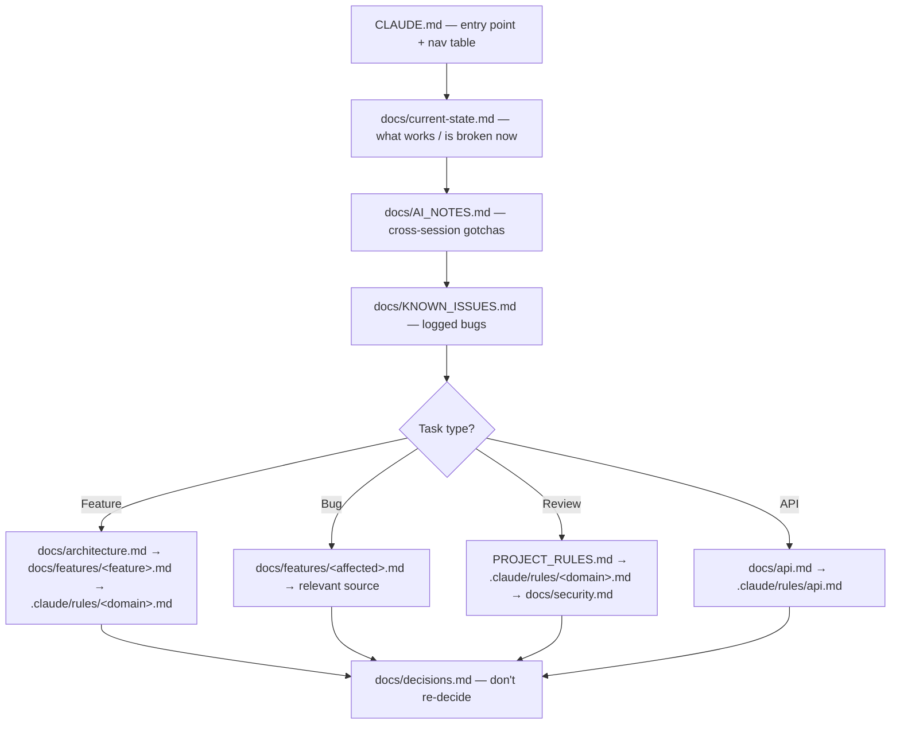

# AI Context

> **Purpose**: Documents what context AI agents receive at the start of a session — which files they should read, in what order, and which context is most important for different types of tasks.
> **Update when**: New context files are added, the reading order changes, or new task types require specific context.

> **See also**: [`agents.md`](agents.md) (who reads what), [`rules.md`](rules.md) (the constraints), [`memory.md`](memory.md) (how context persists), [`../architecture.md`](../architecture.md) (the system being reasoned about), and the entry point [`CLAUDE.md`](../../CLAUDE.md).

---

## The Core Principle: Docs Are Authoritative, Code Is Secondary

Paax runs on one non-negotiable convention, stated in [`AGENTS.md`](../../AGENTS.md#core-principles): **documentation in `docs/` is the source of truth; code is secondary.** This inverts the usual instinct to "just read the code." Here, the code is large, AI-generated, and contains dead paths and stale comments (a comment claims `just_audio` is used — it is not; a comment claims the font is Manrope — it is Roboto). Reading code first will actively mislead you.

So the workflow is: **read the docs to build the mental model, then confirm against code only for the specific lines you are about to change.** When docs and code disagree, that disagreement is itself a bug to be fixed and recorded — not silently resolved in favor of whichever you read last.

---

## Context Loading Strategy

Load context in priority order: essential context first, then task-specific context, then supplementary. The single canonical entry point is [`CLAUDE.md`](../../CLAUDE.md) — its navigation table routes you to everything else.

---

## Essential Context (Always Read)

Read at the start of **every session**, regardless of task, in this order:

| Order | File | What It Tells You |
|-------|------|------------------|
| 1 | [`CLAUDE.md`](../../CLAUDE.md) | Project overview + the navigation table that indexes every other doc |
| 2 | [`AGENTS.md`](../../AGENTS.md) | Coordination rules, agent scope table, the Documentation Contract trigger map |
| 3 | [`docs/architecture.md`](../architecture.md) | The system shape: Flutter client + stateless FastAPI proxies, Deezer metadata + YouTube playback, no server DB |
| 4 | [`docs/current-state.md`](../current-state.md) | What's working, broken, or dormant **right now** |
| 5 | [`docs/AI_NOTES.md`](../AI_NOTES.md) | Warnings and dead-code traps from previous sessions — read before touching anything |
| 6 | [`docs/KNOWN_ISSUES.md`](../KNOWN_ISSUES.md) | Known bugs, so you don't re-investigate them |

The recommended reading order is deliberately **architecture → current-state → relevant feature/rule docs**: understand the shape of the system, then its live status, then the narrow slice you're changing.

---

## Task-Specific Context

Load **in addition to essential context** based on task type.

### When implementing a feature

| File | Why |
|------|-----|
| [`docs/architecture.md`](../architecture.md) | Where your feature fits in the layered client / proxy backend |
| `docs/features/<feature>.md` | Requirements and prior design decisions |
| `.claude/rules/<relevant>.md` | Standards to follow — but read the "aspirational vs enforced" notes in [`rules.md`](rules.md) first |
| `.claude/agents/<profile>.md` | Your role's scope and output checklist |
| [`docs/decisions.md`](../decisions.md) | Check whether this was already decided |

### When fixing a bug

| File | Why |
|------|-----|
| [`docs/KNOWN_ISSUES.md`](../KNOWN_ISSUES.md) | Is it already documented? |
| [`docs/AI_NOTES.md`](../AI_NOTES.md) | Is the "bug" actually intentional dead code? (Many surprising things are — e.g. `getStreamUrl` is defined but unused) |
| `docs/features/<affected>.md` | Expected behavior |

### When reviewing code

| File | Why |
|------|-----|
| [`PROJECT_RULES.md`](../../PROJECT_RULES.md) | The 10 rule sections to check against |
| `.claude/rules/<domain>.md` | Domain-specific detail |
| [`docs/security.md`](../security.md) | Security requirements |

### When working on the API

| File | Why |
|------|-----|
| [`docs/api.md`](../api.md) | The `/v1` (legacy, ytmusicapi) and `/v2` (Deezer+YouTube hybrid, live) endpoint surface |
| `.claude/rules/api.md` | API design standards (note: several are not yet met — see [`rules.md`](rules.md)) |

### When working on "the database"

There is **no server database**. Persistence is client-side [Hive](../architecture.md). The relevant context is:

| File | Why |
|------|-----|
| `docs/database.md` | Documents the Hive box/adapter model as the actual persistence layer |
| `frontend/lib/data/local/hive_storage.dart` | The 5 typed adapters + untyped boxes, the source of truth for state shape |

Ignore `.claude/rules/database.md` and `.claude/rules/supabase.md` for schema work — they describe Postgres/Supabase, which is not wired. See [`rules.md`](rules.md).

---

## Context Window Management

When context is large, prioritize:

1. Essential context (the six files above)
2. The specific feature or area being changed
3. Rules relevant to the current task
4. Historical decisions and notes

If context is limited:

- Skip supplementary docs, but note in your summary what you did **not** read.
- Focus on the most recent entries in [`AI_NOTES.md`](../AI_NOTES.md) and [`current-state.md`](../current-state.md).
- Always read the relevant feature doc and applicable rules before changing behavior.

---

## Updating Context After Work

Every meaningful change must leave the docs consistent — this is the [Documentation Contract](../../AGENTS.md#documentation-contract). After completing work, update:

| What Changed | Update This File |
|-------------|-----------------|
| Feature implemented | `docs/features/<feature>.md`, [`docs/CHANGELOG.md`](../CHANGELOG.md) |
| Bug discovered | [`docs/AI_NOTES.md`](../AI_NOTES.md), [`docs/KNOWN_ISSUES.md`](../KNOWN_ISSUES.md) |
| Architectural decision | [`docs/decisions.md`](../decisions.md) |
| Pattern / gotcha discovered | [`docs/AI_NOTES.md`](../AI_NOTES.md) |
| State changed | [`docs/current-state.md`](../current-state.md) |
| MCP config added | [`docs/ai/mcp.md`](mcp.md) |

The full trigger map lives in [`AGENTS.md`](../../AGENTS.md#documentation-contract) and [`rules.md`](rules.md).

---

*Last updated: 2026-07-16*
