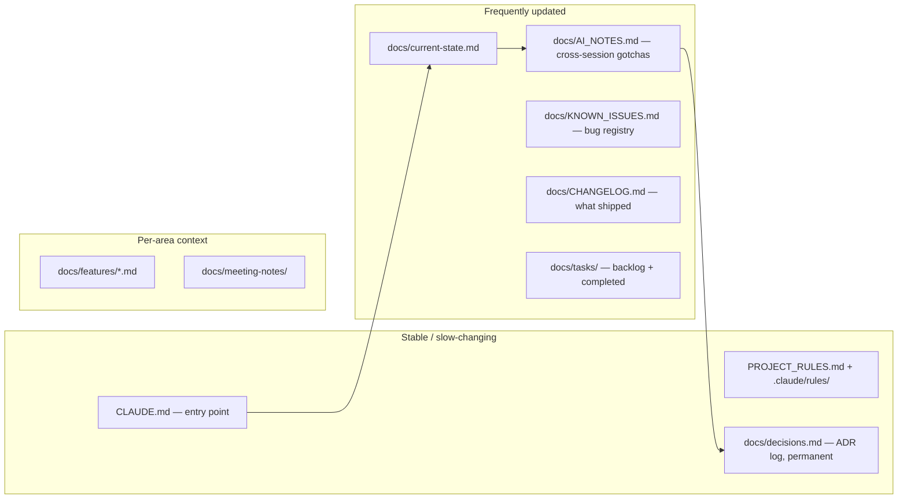

# AI Memory

> **Purpose**: Defines how persistent memory works across AI sessions — what is persisted, where it lives, how agents update it, and how to retrieve relevant memory efficiently.
> **Update when**: New memory patterns are established, the memory structure changes, or a new type of persistent state is needed.

> **See also**: [`context.md`](context.md) (what to read in), [`agents.md`](agents.md) (who writes what), [`rules.md`](rules.md) (the doc-update obligations), [`AGENTS.md`](../../AGENTS.md) (handoff protocol), [`../decisions.md`](../decisions.md) (the ADR log).

---

## Memory Philosophy

AI agents have no inherent memory between sessions. **This documentation system *is* the memory.** Every meaningful observation, decision, or piece of institutional knowledge must be written to the appropriate file to persist across sessions.

> **If it's not written down, it doesn't exist for the next agent.**

This is why Paax treats documentation as a first-class deliverable, not an afterthought — and why [`AGENTS.md`](../../AGENTS.md#core-principles) makes `docs/` authoritative over code. A code change whose knowledge lives only in the diff is effectively lost the moment the session ends.

---

## Memory Architecture



| Layer | File(s) | Cadence |
|-------|---------|---------|
| Project context | [`CLAUDE.md`](../../CLAUDE.md) | High-level, stable |
| Coordination + handoff | [`AGENTS.md`](../../AGENTS.md) | Stable |
| Rules & standards | [`PROJECT_RULES.md`](../../PROJECT_RULES.md), [`.claude/rules/`](../../.claude/rules/) | Stable |
| **Decisions (ADRs)** | [`docs/decisions.md`](../decisions.md) | Append-only, permanent |
| **Current state** | [`docs/current-state.md`](../current-state.md) | Every significant session |
| **Cross-session gotchas** | [`docs/AI_NOTES.md`](../AI_NOTES.md) | Whenever something non-obvious is found |
| Bug registry | [`docs/KNOWN_ISSUES.md`](../KNOWN_ISSUES.md) | On discovery / fix |
| Change log | [`docs/CHANGELOG.md`](../CHANGELOG.md) | On every shipped change |
| Task state | [`docs/tasks/`](../tasks/) (backlog + completed) | On task start/finish |
| Feature knowledge | [`docs/features/*.md`](../features/) | Per-feature changes |
| Meeting notes | [`docs/meeting-notes/`](../meeting-notes/) | As recorded |

---

## The Two Pillars: Decisions and Current State

Two files carry the heaviest memory load and deserve special discipline.

### `docs/decisions.md` — "Don't re-decide what's decided"

The ADR (Architecture Decision Record) log is **permanent and append-only**. Its whole reason for existing is captured in [`AGENTS.md`](../../AGENTS.md#core-principles): *"Check before deciding — always read `docs/decisions.md` before making an architectural choice."* Several of Paax's defining choices are already settled here and must **not** be silently reversed:

- **No server database** — all user state is client-side in Hive.
- **Provider + ChangeNotifier** for state, not Riverpod/Bloc.
- **Manual Navigator + custom shell**, not go_router.
- **YouTube IFrame playback** — the app plays `videoId` directly; the server stream resolvers are not on the live path.
- **Deezer metadata + eager YouTube match ("v2")** as the metadata pipeline.

To reverse any of these, you must write a **new ADR** that supersedes the old one (mark the old one `SUPERSEDED by: ...`). Never edit history to pretend a decision didn't happen. Unresolved questions get an entry marked `STATUS: OPEN` so a later session resolves them ([conflict resolution](../../AGENTS.md#conflict-resolution)).

### `docs/current-state.md` — the live snapshot

Where [`decisions.md`](../decisions.md) is permanent, [`current-state.md`](../current-state.md) is a **living snapshot** of what works, what's broken, and what's dormant right now. It is the first thing the next session reads after `CLAUDE.md`. Update it whenever the observable state of the project changes — a feature lands, a bug appears, a component goes dormant.

### `docs/AI_NOTES.md` — the surprise buffer

[`AI_NOTES.md`](../AI_NOTES.md) is the running scratchpad for *"things that will surprise you"* — dead code that looks live, stale comments, integration quirks. It is dated, categorized, and never deleted (stale notes are marked `[STALE?]` or `[SUPERSEDED by: ...]`). Read its **Warnings** section before touching anything.

---

## What to Persist

### Always persist
- Architectural decisions → [`docs/decisions.md`](../decisions.md)
- Non-obvious bugs, gotchas, dead-code traps → [`docs/AI_NOTES.md`](../AI_NOTES.md)
- Completed tasks → [`docs/tasks/completed.md`](../tasks/) and [`docs/CHANGELOG.md`](../CHANGELOG.md)
- State changes → [`docs/current-state.md`](../current-state.md)

### Persist when relevant
- Performance observations → [`docs/AI_NOTES.md`](../AI_NOTES.md), `docs/OPTIMIZATION_LOG.md` (with before/after numbers)
- Security findings → [`docs/AI_NOTES.md`](../AI_NOTES.md), [`docs/KNOWN_ISSUES.md`](../KNOWN_ISSUES.md)
- Integration quirks (Deezer, YouTube, image 429s) → [`docs/AI_NOTES.md`](../AI_NOTES.md)
- New patterns → [`docs/AI_NOTES.md`](../AI_NOTES.md), `docs/coding-standards.md`

### Do NOT persist
- Intermediate reasoning steps
- Dead-end exploration (unless the dead end is itself the lesson)
- Duplicate information already in another doc

---

## Handoff Protocol (from AGENTS.md)

When one agent finishes and another continues ([`AGENTS.md` › Handoff Protocol](../../AGENTS.md#handoff-protocol)):

1. Leave a short summary at the top of significantly modified files (optional but encouraged).
2. Update the relevant `docs/` file(s) per the [trigger map](rules.md#documentation-trigger-map).
3. Record the completed task in [`docs/tasks/completed.md`](../tasks/).
4. If a decision was made, add it to [`docs/decisions.md`](../decisions.md).

Because sessions run sequentially and share only the docs, a clean handoff *is* the memory transfer. A session that ships code but skips steps 2–4 has erased its own work from the project's memory.

---

## Memory Update Protocol

At the end of every session that produces significant work:

```markdown
## Session Wrap-Up Checklist
- [ ] Updated docs/current-state.md with the current project state
- [ ] Added new observations/gotchas to docs/AI_NOTES.md
- [ ] Logged completed tasks in docs/tasks/completed.md + docs/CHANGELOG.md
- [ ] Added any new architectural decisions to docs/decisions.md
- [ ] Updated relevant docs/features/*.md with implementation details
- [ ] Added any discovered bugs to docs/KNOWN_ISSUES.md
```

---

## Memory Retrieval Heuristic

To find relevant memory for a task:

```
1. What feature is this about?        → docs/features/<feature>.md
2. Is there a known issue?            → docs/KNOWN_ISSUES.md
3. Was this already decided?          → docs/decisions.md (grep keywords)
4. Did a prior agent warn about this? → docs/AI_NOTES.md (Warnings first)
5. What is the current state?         → docs/current-state.md
6. Are there relevant rules?          → .claude/rules/<domain>.md + docs/ai/rules.md
```

---

## Memory Quality Rules

- **Be specific.** "Fixed a bug" is useless. "Fixed the media-notification going stale because `paax_audio_handler` wasn't re-pushed on track change — now pushed from PlaybackController's playing→session wiring" is valuable.
- **Be actionable.** The next agent should act on the note without re-investigating.
- **Date everything** with `YYYY-MM-DD`.
- **Mark stale notes** `[STALE?]` rather than deleting; mark replaced notes `[SUPERSEDED by: ...]`.
- **Attribute decisions** — human, a specific AI session, or both.

---

*Last updated: 2026-07-16*
