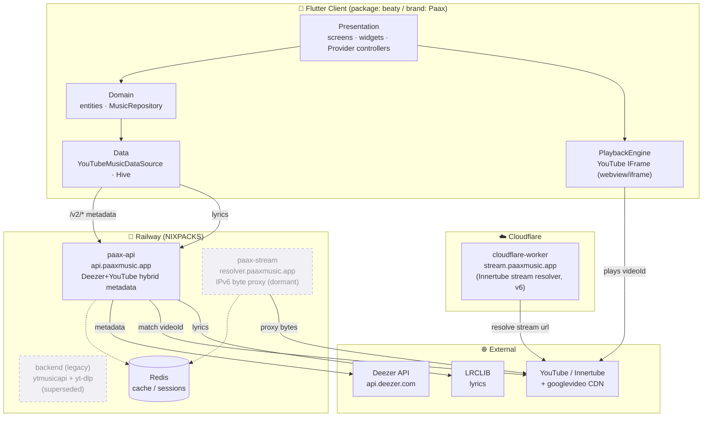
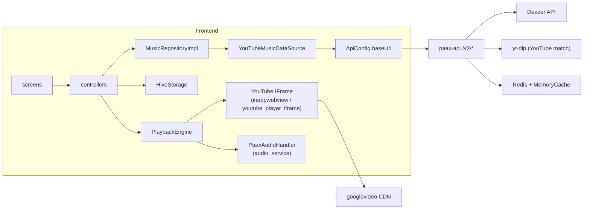

# Architecture

> **Purpose**: Describes the high-level architecture of the system. All agents must read this before making structural decisions.
> **Update when**: A new service is added, a major refactor changes the system topology, or an architectural decision is finalized.
>
> **New to the project?** Read [onboarding.md](onboarding.md) first for the mental model and a local run, and keep [glossary.md](glossary.md) handy for terminology.

---

## Overview

**Paax** is a cross-platform music streaming client (Android + Web/PWA/TWA) that behaves like Spotify or Apple Music but owns no music catalog of its own. It composes two third-party sources at runtime: **Deezer** supplies clean catalog *metadata* (artists, albums, tracks, cover art), and **YouTube** supplies the actual *audio* (a matched `videoId` played through an embedded YouTube IFrame). The glue that makes these two worlds line up is the **hybrid "v2" pipeline** in `paax-api`, which matches every Deezer track to the best YouTube video and returns both together.

Architecturally the system is a **thin-server / thick-client** design: the Flutter app holds *all* user state locally in Hive (there is **no server-side database**), and the backend services are **stateless metadata and streaming proxies** backed only by caches. This keeps hosting cheap, sidesteps user-data compliance, and lets the app work largely offline for browsing its own library.



> Dashed components (`paax-stream`, legacy `backend`) are deployed/present but **not on the live playback path** today. See [Known Limitations](#known-limitations) and [decisions.md](decisions.md) (ADR-006).

---

## System Components

| Component | Role | Language/Framework | Repository/Path | Status |
|-----------|------|--------------------|-----------------|--------|
| **Flutter client** | The app: UI, playback, local library, all user state | Flutter 3.3+/Dart 3 (package `beaty`) | [`frontend/`](../frontend) | **Active** |
| **paax-api** | Hybrid metadata & discovery API (Deezer metadata + YouTube playback matching); lyrics | Python 3.11 / FastAPI 0.115 | [`paax-api/`](../paax-api) | **Active** (live path) |
| **cloudflare-worker** | Edge stream-URL resolver via YouTube Innertube (`stream.paaxmusic.app`) | JavaScript (Cloudflare Workers) | [`cloudflare-worker/`](../cloudflare-worker) | Active (edge) |
| **paax-stream** | IPv6-rotating audio **byte proxy** (`resolver.paaxmusic.app`) | Python 3.11 / FastAPI 0.115 | [`paax-stream/`](../paax-stream) | Deployed, **not consumed** by live app |
| **backend (legacy)** | Original monolith: ytmusicapi metadata + yt-dlp streaming | Python 3.11 / FastAPI | [`backend/`](../backend) | **Superseded** by paax-api |
| **Redis** | Response cache (paax-api), IPv6 session store (paax-stream) | Railway plugin | — | Optional/active |

On the **live path** there is still **no**: relational database, ORM, message queue, background worker fleet, object storage, or authentication server — the "database" is client-side Hive ([database.md](database.md)); [backend/queue.md](backend/queue.md)/[backend/workers.md](backend/workers.md) explain what plays those roles. As of 2026-07-16 a **Supabase foundation exists but is not connected** to any of the components above — see [Supabase foundation](#supabase-foundation-phase-1-deployed-2026-07-16-not-yet-integrated) below and [backend/database-schema.md](backend/database-schema.md).

### Client-side layering

The Flutter app uses a **layer-first (Clean-ish) architecture**, not the feature-first layout that `.claude/rules/flutter.md` prescribes:

```
frontend/lib/
  core/          # config, constants, image pipeline, network throttling, playback engine, theme, utils
  data/          # api (data sources), local (Hive), repositories
  domain/        # entities (Hive models), repository interface, services (lyrics)
  presentation/  # screens, widgets, state (Provider controllers)
```

Details: [frontend/state-management.md](frontend/state-management.md), [frontend/screens.md](frontend/screens.md), [frontend/widgets.md](frontend/widgets.md), [features/player.md](features/player.md).

### Dependency graph (module → dependency)



See [tech-stack.md](tech-stack.md) and [DEPENDENCIES.md](DEPENDENCIES.md) for the full library inventory.

---

## Supabase foundation (Phase 1, deployed 2026-07-16, not yet integrated)

> **Status: deployed foundation, NOT connected.** Per [decisions.md](decisions.md) **ADR-009** (which supersedes ADR-002's "no server DB"), a Supabase project (`jecgmiuypuathhvjuhea`) now holds the persistent foundation for real auth, a durable catalog, social data, and cloud sync. **Nothing consumes it yet** — the Flutter app still uses Hive + demo auth, `paax-api` is unchanged, and the live data flow remains exactly as described in [Data Flow](#data-flow) above.

**What is deployed (Phase 1)** — full reference in [backend/database-schema.md](backend/database-schema.md):

- Postgres schema: **34 RLS-enabled tables** (catalog, profiles, library/social, playlists, stories, billing, notifications), 6 views, secure functions/triggers, `pg_trgm` search indexes.
- Supabase Auth wiring (signup trigger → profile) and **3 Storage buckets** with policies (`music-images`, `user-avatars`, `story-media`).
- Seeded subscription plans/features (provider-agnostic billing readiness; **no live Stripe** — Edge Function scaffolds in `supabase/functions/` are undeployed).
- 11 migrations in `supabase/migrations/` (repo ↔ remote 1:1) and `scripts/bootstrap-owner.mjs` for the owner test account.

**Target architecture (ADR-009, later phases)**: `Deezer API + YouTube matcher → paax backend → Supabase → Flutter`, with **Redis strictly transient** (cache/locks/job state, never source of truth). **YouTube's role narrows to a playback-video-ID provider** — matched IDs persist on `tracks.youtube_*` columns instead of a 7-day Redis cache — and **IFrame playback is unchanged** (ADR-004 stands; no audio bytes are ever stored). Rollout: Phase 2 backend ingestion + YouTube matcher, Phase 3 Flutter integration + Hive migration, Phase 4 social, Phase 5 Stripe.

Until those phases land, treat every diagram and flow in this document as the current reality.

---

## Communication Patterns

- **Synchronous**: REST/JSON over HTTPS is the only inter-component protocol. The client calls `paax-api` `/v2/*` endpoints for metadata and `/lyrics` for lyrics. `paax-api` calls Deezer and (via `yt-dlp`) YouTube synchronously per request. See [api.md](api.md).
- **Playback**: The client does **not** call a streaming backend on the live path — it hands the matched `videoId` to a YouTube IFrame that talks directly to YouTube/`googlevideo` CDN. The stream resolvers (`cloudflare-worker`, `paax-stream`) exist as alternative generations; see [features/player.md](features/player.md) and [backend/workers.md](backend/workers.md).
- **Asynchronous / eventing**: None across services. *Within* `paax-api`, request-time concurrency uses `asyncio.gather` + `Semaphore(3)` (chart `Semaphore(5)`) to parallelize per-track YouTube matching; `yt-dlp` search runs in a `ThreadPoolExecutor`. See [backend/queue.md](backend/queue.md).
- **Realtime**: None. No WebSockets, no push. The only "live" surface is the OS media session (Android Foreground Service) driven locally by the app — see [features/notifications.md](features/notifications.md).
- **Client ↔ OS**: `audio_service` bridges to the Android media session; a JS↔Dart bridge (`PaaxBridge`) connects the WebView player to `PlaybackController`.

---

## Data Flow

**Browse a track and play it (the canonical flow):**

1. User searches or opens a screen; a Provider controller calls `MusicRepositoryImpl` → `YouTubeMusicDataSource` → `GET api.paaxmusic.app/v2/...`.
2. `paax-api` fetches metadata from **Deezer** (`api.deezer.com`, no key), and for each track runs a **YouTube match** (`yt-dlp ytsearch`, scored on duration/title/artist/trust) to attach a `playback` block with a `videoId`.
3. Response (Deezer metadata + `playback.videoId`) is cached (Redis + memory) and returned. The client maps it so `Track.id = playback.videoId`.
4. UI renders. User taps play → `PlaybackController.playQueue(...)` → `PlaybackEngine.load(videoId)`.
5. The **YouTube IFrame** (mobile `flutter_inappwebview`, web `youtube_player_iframe`) loads and plays the video's audio directly from the `googlevideo` CDN. `PaaxAudioHandler` keeps the Android Foreground Service alive and shows the media notification.
6. Any state the user changes (like, save, follow, add-to-playlist, recently-played) is written to **Hive** locally. Nothing leaves the device.

See the sequence diagram in [features/player.md](features/player.md) and the metadata pipeline in [backend/services.md](backend/services.md).

---

## Infrastructure

- **Cloud Provider**: **Railway** hosts the three Python services (`paax-api`, `paax-stream`, legacy `backend`) via the **NIXPACKS** builder, `restartPolicyType=ON_FAILURE` (max 5 retries). **Cloudflare** hosts the Workers stream resolver.
- **Containerization**: None explicit — NIXPACKS builds each service from `requirements.txt` + a `uvicorn` start command (`Procfile`/`railway.json`).
- **CDN**: Cloudflare (edge worker + DNS for `*.paaxmusic.app`). Media/art is served straight from Deezer (`dzcdn.net`) and Google (`lh3-lh6.googleusercontent.com`, `googlevideo.com`) — Paax stores no assets.
- **CI/CD**: None configured in-repo (no GitHub Actions). Deploys are Railway/Cloudflare push-to-deploy. See [deployment.md](deployment.md).
- **Domains**: `api.paaxmusic.app` (paax-api), `resolver.paaxmusic.app` (paax-stream), `stream.paaxmusic.app` (worker), `paaxmusic.app` (web/PWA).
- **Secrets**: `oauth.json`/`YTMUSIC_OAUTH_JSON` (gitignored) and `REDIS_URL` via Railway variables. See [environment.md](environment.md).

---

## Scaling Strategy

- **Horizontal scaling**: All Python services are stateless (state lives in Redis + client Hive), so they scale horizontally behind Railway. The Cloudflare Worker scales automatically at the edge.
- **Caching layer**: The primary scaling lever. `paax-api` caches metadata aggressively (search 15 min, home/artist/chart 6 h, album 24 h) and YouTube matches for **7 days**, so repeat browsing rarely re-hits Deezer/YouTube. The Worker caches resolved stream URLs 5 min. See [CACHE_STRATEGY.md](CACHE_STRATEGY.md) and [performance.md](performance.md).
- **Client offload**: Because playback runs through a YouTube IFrame directly against Google's CDN, Paax serves **no audio bytes** on the live path — the most bandwidth-intensive work never touches our infrastructure.
- **The scaling risk** is the **eager YouTube matching** in `paax-api`: each uncached track needs up to three `yt-dlp` searches through a `ThreadPoolExecutor(max_workers=3)` + `Semaphore(3)`. Under cold-cache load this is the bottleneck. See [performance.md](performance.md).
- **Database replication**: N/A — no server database.

---

## Key Architectural Decisions

Full rationale in [decisions.md](decisions.md). Highlights:

- **ADR-001** — Deezer metadata + YouTube playback ("hybrid v2"): clean catalog data without licensing, real audio without hosting.
- **ADR-002** — Client-side Hive as the only user datastore: **SUPERSEDED by ADR-009** (2026-07-16) — Hive remains the live client store until migration, but the "no server DB" decision is reversed.
- **ADR-003** — Provider + ChangeNotifier for state (not Riverpod/Bloc): minimal ceremony for a solo maintainer.
- **ADR-004** — YouTube IFrame for playback (not `just_audio`/stream extraction): survives YouTube's format/anti-bot churn; `flutter_inappwebview` enables background audio.
- **ADR-005** — Image request throttling & domain sharding: mandatory to survive Google/Deezer 429 rate limits, especially on web.
- **ADR-006** — Multiple streaming generations coexist (IFrame live; Worker + IPv6 proxy standby): hedging against YouTube blocking any single method.
- **ADR-009** — Adopt Supabase for auth, persistent catalog, social data, and cloud sync: Phase 1 foundation deployed 2026-07-16, integration pending (see [Supabase foundation](#supabase-foundation-phase-1-deployed-2026-07-16-not-yet-integrated)).

---

## Known Limitations

- **Streaming is fragmented.** Three stream mechanisms exist (IFrame — live; Cloudflare Worker Innertube resolver; `paax-stream` IPv6 byte proxy — dormant), plus a broken legacy resolver. Only the IFrame path runs in the app; `ApiConfig.streamBaseUrl` and `MusicRepository.getStreamUrl` are wired but unused. This needs consolidation. See [KNOWN_ISSUES.md](KNOWN_ISSUES.md), [TECH_DEBT.md](TECH_DEBT.md).
- **No real authentication.** App "login" is a hardcoded demo stub; server "auth" is one shared YouTube account. No per-user identity or cloud sync. See [security.md](security.md), [backend/auth.md](backend/auth.md).
- **Eager YouTube matching** makes cold-cache metadata endpoints latency-sensitive (multi-second) and rate-limit-exposed.
- **No automated tests / CI.** `flutter analyze` + `dart format` are the only gates. See [testing.md](testing.md).
- **Dead/orphaned code** in several places (`deezer_api_client`, `media_session_web`, `paax-stream` resolver stack, legacy `backend`). See [AI_NOTES.md](AI_NOTES.md).
- **Branding/config drift**: Android `applicationId` is still `com.beaty.music.beaty` and release builds sign with **debug keys**. See [deployment.md](deployment.md).
- **Deezer client uses `verify=False`** (TLS validation disabled) — a real security gap. See [security.md](security.md).

---

*Last updated: 2026-07-16*
