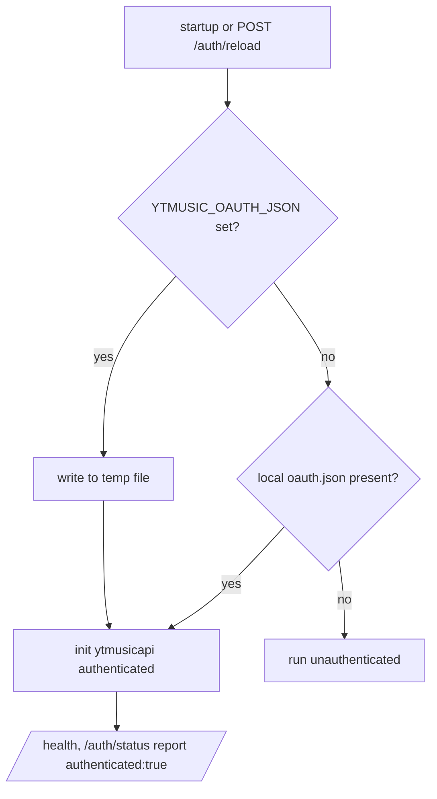

# Backend Auth

> **Purpose**: Documents backend-side authentication and authorization implementation — token handling, middleware, session management, and security controls.
> **Update when**: Auth implementation changes, token structure changes, or new auth methods are added.

> **See also**: [`../security.md`](../security.md) for the security posture, [`controllers.md`](controllers.md) for the (unauthenticated) mutation routes, [`../frontend/state-management.md`](../frontend/state-management.md) for the client `AuthController`.

---

## Auth Model

> **Read this first**: the **live auth path has no real authentication anywhere** — not on the client, not on the server. What follows describes that actual, deliberately-minimal reality. Separately, a real **Supabase Auth foundation was deployed on 2026-07-16** (see the dedicated section below), but **nothing consumes it yet** — no app or service validates a Supabase JWT today. Do not document JWT/middleware flows as live until Flutter/backend integration lands.

There are two distinct "auth" concepts, both non-standard:

1. **Client-side demo auth** (fake): a local login stub with hardcoded credentials, used to gate onboarding UI. No server involved.
2. **Server-side shared-account OAuth** (not per-user): a single YouTube Music account's OAuth token, used only so ytmusicapi's *authenticated* endpoints work. Every caller shares it.

- **Mechanism**: None (no user identity crosses the wire).
- **Token Type**: No access/refresh tokens. No JWT. No sessions.
- **Token Location**: N/A — clients send no auth header. The server reads a single OAuth blob from an env var (`YTMUSIC_OAUTH_JSON`).
- **Signing Algorithm**: Not applicable — no tokens are signed or verified.

---

## Token Structure

**Not applicable — the system issues and validates no tokens.**

The only credential in the system is the **shared YouTube Music OAuth JSON** consumed by ytmusicapi. It is a Google OAuth blob (not a Paax-issued token), supplied out-of-band via env and never exposed to clients. Its shape is defined by Google/ytmusicapi, not by us, and it is never decoded or trusted as a *user* identity.

```jsonc
// NOT a Paax user token — this is the single shared ytmusicapi OAuth blob
// held server-side in YTMUSIC_OAUTH_JSON. There is exactly one of these,
// and it authenticates the server *as one account*, for all callers.
{
  "access_token": "...",
  "refresh_token": "...",
  "scope": "https://www.googleapis.com/auth/youtube",
  "token_type": "Bearer",
  "expires_at": 0
}
```

---

## Client-side demo auth (the "login" users see)

Implemented entirely in the Flutter `AuthController` ([`../frontend/state-management.md`](../frontend/state-management.md)); **there is no server call**:

- `login(email, password)`: succeeds only for hardcoded `user@gmail.com` / `12345`, then saves `UserProfile(name:"Uziel")` to Hive.
- `signup(...)`: **always succeeds** (no validation, no persistence of credentials).
- `logout()`: `HiveStorage.clearAll()` — wipes local state.
- State: `currentUser`, `isAuthenticated`, `onboardingCompleted` — all local.

> **Why it exists**: the app ships an onboarding/login *flow* for UX parity with Spotify/Apple Music, but user state is entirely local (Hive — see [`../database.md`](../database.md)), so real accounts would add server + DB complexity the product does not need yet. It is a stub, and it is documented as such so nobody mistakes it for a security boundary. Its replacement (Supabase Auth, below) is deployed but not yet wired into the client — the stub remains the live path until Phase 3 ([`../decisions.md`](../decisions.md) ADR-009).

---

## Supabase Auth foundation (Phase 1 — deployed, NOT integrated)

Deployed 2026-07-16 per ADR-009. **Status: implemented server-side, consumed by nothing** — the client stub above remains the live path. Full schema context: [`database-schema.md`](database-schema.md).

- **Single identity authority**: Supabase Auth (project `jecgmiuypuathhvjuhea`) is the sole source of user identity going forward. Server-validated JWTs; no Paax-minted tokens.
- **Signup → profile**: `private.handle_new_user()` (AFTER INSERT on `auth.users`, security definer, pinned `search_path`) auto-creates the `profiles` row. It uses the metadata username only if valid (`^[a-z0-9_.]{3,30}$`) **and** free, else derives `user_<id>`; it **never fails signup** and **never grants role/tier from metadata**.
- **Privileged columns are trigger-protected**: `profiles.app_role` and the `subscription_tier/status/expires_at` cache are guarded by `protect_profiles_privileged_columns` — clients can never self-assign roles or paid tiers.
- **Password policy**: minimum 8 chars with upper + lower + digit + special. App-side validation regex: `^(?=.*[a-z])(?=.*[A-Z])(?=.*\d)(?=.*[^A-Za-z0-9]).{8,}$`.
- **⚠️ MANUAL DASHBOARD STEP REQUIRED** (the MCP cannot set this): Supabase Dashboard → **Authentication → Sign In / Providers → Email** → set *minimum password length* to **8** and *required characters* to **"lowercase, uppercase, digits and symbols"**. Until done, the server accepts weaker passwords than the app enforces.
- **Owner bootstrap**: `scripts/bootstrap-owner.mjs` creates the owner account — fully env-driven (`PAAX_OWNER_*`, see [`../environment.md`](../environment.md)), no credentials in the repo.
- **`service_role` key is server/scripts-only** — it must **never** ship in Flutter or any client. Clients will use the `anon` key when integration lands.

---

## Middleware

### Auth Middleware

**Not applicable — no auth middleware exists on any backend.**

No route extracts or verifies an `Authorization` header. The only middleware in the stack is `CORSMiddleware` ([`controllers.md`](controllers.md)). The template's "validate JWT on every protected request" flow does not exist because there are no protected requests and no JWTs.

### Server-side OAuth resolution (startup, not per-request)

The shared ytmusicapi credential is resolved **once at startup / on `/auth/reload`**, not per request:



`GET /auth/status` and `GET /health` report whether the shared account loaded. `POST /auth/reload` re-reads the source.

---

## Token Refresh Flow

**Not applicable — no Paax tokens exist to refresh.**

The only refresh in the system is Google's OAuth refresh *inside* ytmusicapi, using the shared blob's `refresh_token`. That is handled by the library, is account-wide (not user-scoped), and never surfaces to clients.

---

## Authorization

**Effectively none.** There is no per-user identity to authorize against.

- **Model**: No RBAC, no ownership checks. The v1 mutation routes (`/rate`, `/playlists`, `/playlists/{id}`, `/playlists/{id}/items`) mutate the **single shared account** — any caller can invoke them.
- **Enforcement point**: None server-side. The only thing limiting write access is that the routes are somewhat obscure and unadvertised — **security through obscurity, which is not security**.
- **User roles**: None.

### Role Permissions Table

**Not applicable — there are no roles.** For completeness, the *de facto* model is:

| Role | Can Read Own Data | Can Write Own Data | Can Read All Data | Can Write All Data |
|------|------------------|--------------------|-------------------|--------------------|
| Any anonymous caller | N/A (no per-user data on server) | N/A | ✅ (all metadata is public) | ✅ (mutates shared account) |

The "own data" columns are N/A because user data lives client-side in Hive, never on the server.

---

## Session Invalidation

**Not applicable — there are no server sessions.**

- **Logout**: client-side only — `HiveStorage.clearAll()` wipes the local profile and library. No server state to invalidate.
- **Force logout all devices**: impossible/meaningless — devices share no server identity.
- **Account deletion**: equivalent to clearing local data; there is no server-side account record ([`database-schema.md`](database-schema.md)).

---

## Security Considerations

Honest assessment of the real risks (see [`../security.md`](../security.md)):

- **Unauthenticated shared-account mutations**: `/rate` and `/playlists*` let *anyone* who finds the endpoint modify the one shared YouTube Music account. This should be gated (a server-side secret header at minimum) or removed if unused.
- **No per-user auth is by design, but the demo login must not be mistaken for one.** The hardcoded creds (`user@gmail.com`/`12345`) are visible in the client source — never treat client auth as trusted.
- **`YTMUSIC_OAUTH_JSON` is a live Google credential.** It must stay server-only (env/secret manager), never shipped to the client, and be rotated if leaked. The temp-file materialization should be in a private path.
- **No rate limiting / brute-force protection** exists on any route ([`controllers.md`](controllers.md)) — but since there is no login to brute-force server-side, the real exposure is abuse of the expensive matching/stream routes, not credential stuffing.
- **No tokens are logged** — trivially true, since there are none.

> **Future direction — foundation now deployed, integration pending**: Supabase Auth is provisioned (section above, ADR-009); Phase 3 will wire the client `AuthController` to it, with per-user JWTs validated in middleware. Until then, treat the entire *live* auth surface as **cosmetic**.

---

*Last updated: 2026-07-16*
