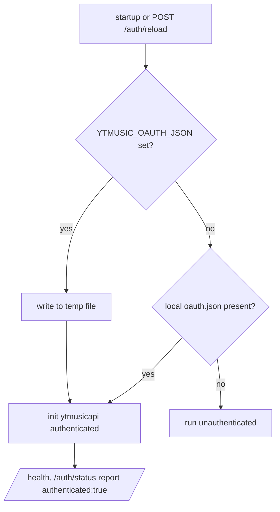

# Backend Auth

> **Purpose**: Documents backend-side authentication and authorization implementation — token handling, middleware, session management, and security controls.
> **Update when**: Auth implementation changes, token structure changes, or new auth methods are added.

> **See also**: [`../features/authentication.md`](../features/authentication.md) for the full end-user auth design (Phase 3.1), [`../security.md`](../security.md) for the security posture, [`controllers.md`](controllers.md) for the (unauthenticated) mutation routes, [`../frontend/state-management.md`](../frontend/state-management.md) for the client `AuthController`.

---

## Auth Model

> **Read this first**: end-user auth is now **real** — as of **Phase 3.1 (2026-07-17)** the Flutter app authenticates against **Supabase Auth** (PKCE, anon key only), with real accounts, email verification, password recovery, and RLS-protected `profiles`. The old client-side demo stub is **gone**. The full client-side design lives in [`../features/authentication.md`](../features/authentication.md); this page focuses on the **backend** side. Note that **paax-api itself still validates no Supabase JWT** — its v1 write endpoints remain unauthenticated against a shared server account (see below). Do not document paax-api JWT/middleware flows as live; identity today is enforced by Supabase + Postgres RLS, not by paax-api.

There are two distinct "auth" concepts:

1. **End-user auth** (real, Phase 3.1): Supabase Auth is the single identity authority. The app holds only the `anon` key; every `profiles` access is enforced by RLS. Fully documented in [`../features/authentication.md`](../features/authentication.md).
2. **Server-side shared-account OAuth** (not per-user): a single YouTube Music account's OAuth token, used only so ytmusicapi's *authenticated* endpoints work. Every caller of paax-api shares it — it is unrelated to app login.

Regarding **paax-api** specifically:
- **Mechanism**: None — paax-api does not read or verify a user identity header. User identity is enforced upstream by Supabase/RLS, not by the API.
- **Token Type**: paax-api issues no tokens. Supabase issues short-lived JWTs to the app (refreshed by the SDK); paax-api does not consume them yet.
- **Token Location**: paax-api reads a single OAuth blob from an env var (`YTMUSIC_OAUTH_JSON`); it expects no `Authorization` header on its v1 routes.
- **Signing Algorithm**: N/A for paax-api — it signs/verifies nothing. Supabase JWTs are signed by GoTrue.

---

## Token Structure

**paax-api issues and validates no tokens.** User-facing tokens are Supabase-issued JWTs handled entirely by the app and Supabase (see [`../features/authentication.md`](../features/authentication.md)); paax-api does not consume them.

The only credential paax-api holds is the **shared YouTube Music OAuth JSON** consumed by ytmusicapi. It is a Google OAuth blob (not a Paax-issued token), supplied out-of-band via env and never exposed to clients. Its shape is defined by Google/ytmusicapi, not by us, and it is never decoded or trusted as a *user* identity.

```jsonc
// NOT a Paax user token — this is the single shared ytmusicapi OAuth blob
// held server-side in YTMUSIC_OAUTH_JSON. There is exactly one of these,
// and it authenticates the server *as one account*, for all callers.
{
  "access_token": "...",
  "refresh_token": "...",
  "scope": "https://www.googleapis.com/auth/youtube",
  "token_type": "Bearer",
  "expires_at": 0
}
```

---

## Client-side auth (real, Supabase — Phase 3.1)

The former demo login stub (hardcoded `user@gmail.com` / `12345`, `auth_screen.dart`, and the old intro `onboarding_screen.dart`) has been **removed**. The Flutter app now authenticates against **Supabase Auth** through an injectable `AuthRepository`, with a deterministic `AuthController`/`AppAuthState` + `AuthGate` state machine driving routing:

- Real email+password sign-in, a 3-step registration wizard, mandatory email verification (`paax://auth/confirm`), password recovery (`paax://auth/reset-password`), and a Complete-Profile fallback.
- The client holds **only the anon key** (PKCE flow); the `service_role` key never ships in the app.
- `logout()` calls Supabase `signOut()` and clears in-memory auth state — it **no longer** runs `HiveStorage.clearAll()`; the on-device library is preserved (the separate Profile "Clear Data" action wipes local data).

Full design, flows, error handling, and verification: [`../features/authentication.md`](../features/authentication.md) and [`../frontend/state-management.md`](../frontend/state-management.md). See also [`../decisions.md`](../decisions.md) ADR-009.

---

## Supabase Auth (Phase 1 foundation → Phase 3.1 integrated)

Foundation deployed 2026-07-16 per ADR-009; **wired into the Flutter app in Phase 3.1 (2026-07-17)** — it is now the live end-user auth path. Full schema context: [`database-schema.md`](database-schema.md); client integration: [`../features/authentication.md`](../features/authentication.md).

- **Single identity authority**: Supabase Auth (project `jecgmiuypuathhvjuhea`) is the sole source of user identity going forward. Server-validated JWTs; no Paax-minted tokens.
- **Signup → profile**: `private.handle_new_user()` (AFTER INSERT on `auth.users`, security definer, pinned `search_path`) auto-creates the `profiles` row. It uses the metadata username only if valid (`^[a-z0-9_.]{3,30}$`) **and** free, else derives `user_<id>`; it **never fails signup** and **never grants role/tier from metadata**.
- **Privileged columns are trigger-protected**: `profiles.app_role` and the `subscription_tier/status/expires_at` cache are guarded by `protect_profiles_privileged_columns` — clients can never self-assign roles or paid tiers.
- **Password policy**: minimum 8 chars with upper + lower + digit + special. App-side validation regex: `^(?=.*[a-z])(?=.*[A-Z])(?=.*\d)(?=.*[^A-Za-z0-9]).{8,}$`.
- **⚠️ MANUAL DASHBOARD STEP REQUIRED** (the MCP cannot set this): Supabase Dashboard → **Authentication → Sign In / Providers → Email** → set *minimum password length* to **8** and *required characters* to **"lowercase, uppercase, digits and symbols"**. Until done, the server accepts weaker passwords than the app enforces.
- **Owner bootstrap**: `scripts/bootstrap-owner.mjs` creates the owner account — fully env-driven (`PAAX_OWNER_*`, see [`../environment.md`](../environment.md)), no credentials in the repo.
- **`service_role` key is server/scripts-only** — it must **never** ship in Flutter or any client. The app uses the `anon` key only (integration landed in Phase 3.1).

---

## Middleware

### Auth Middleware

**Not applicable — no auth middleware exists in paax-api.**

No paax-api route extracts or verifies an `Authorization` header. The only middleware in the stack is `CORSMiddleware` ([`controllers.md`](controllers.md)). User JWTs now exist (Supabase-issued), but paax-api does not consume them — identity enforcement lives in Supabase/RLS, not in the API. Wiring per-user JWT validation into paax-api middleware is future work.

### Server-side OAuth resolution (startup, not per-request)

The shared ytmusicapi credential is resolved **once at startup / on `/auth/reload`**, not per request:



`GET /auth/status` and `GET /health` report whether the shared account loaded. `POST /auth/reload` re-reads the source.

---

## Token Refresh Flow

**Not handled by paax-api.** User access tokens are Supabase JWTs, refreshed automatically by `supabase_flutter` (rotated refresh tokens in the platform secure store) — see [`../features/authentication.md`](../features/authentication.md). paax-api mints and refreshes nothing.

The only refresh inside paax-api is Google's OAuth refresh *inside* ytmusicapi, using the shared blob's `refresh_token`. That is handled by the library, is account-wide (not user-scoped), and never surfaces to clients.

---

## Authorization

**Split between two surfaces.** User identity/profile data is authorized by **Postgres RLS** on Supabase (`profiles`): a user may read/write only their own row (`auth.uid() = id`), and privileged columns (`app_role`, `subscription_*`) are trigger-protected (`42501`) — see [`../features/authentication.md`](../features/authentication.md). **paax-api has no authorization of its own.**

- **Model (paax-api)**: No RBAC, no ownership checks. The v1 mutation routes (`/rate`, `/playlists`, `/playlists/{id}`, `/playlists/{id}/items`) mutate the **single shared YouTube Music account** — any caller can invoke them.
- **Enforcement point (paax-api)**: None server-side. The only thing limiting write access is that the routes are somewhat obscure and unadvertised — **security through obscurity, which is not security**.
- **User roles**: `profiles.app_role` exists (server-managed, trigger-guarded), but paax-api does not read it — no API route is role-gated yet.

### Role Permissions Table

paax-api's v1 surface is still role-agnostic. The *de facto* model:

| Surface | Can Read Own Data | Can Write Own Data | Can Read All Data | Can Write All Data |
|------|------------------|--------------------|-------------------|--------------------|
| Supabase `profiles` (authenticated user) | ✅ own row (RLS) | ✅ own row, non-privileged cols only | ❌ | ❌ |
| paax-api v1 caller (anon) | N/A (no per-user data in API) | N/A | ✅ (all metadata is public) | ✅ (mutates shared account) |

paax-api's "own data" columns are N/A because per-user data lives either in Supabase (identity) or on-device in Hive (library) — never in paax-api.

---

## Session Invalidation

Managed by **Supabase**, not paax-api.

- **Logout**: `AuthController.logout()` calls Supabase `signOut()` (revokes the session server-side) and clears in-memory auth state. It **no longer** wipes Hive — the local library persists. (The Profile "Clear Data" action wipes local data separately.)
- **Force logout all devices**: available via Supabase session/refresh-token revocation (not yet surfaced as an app feature).
- **Account deletion**: an in-app deletion flow is not yet implemented; the `profiles` row and `auth.users` record are the server-side account of record ([`database-schema.md`](database-schema.md)).

---

## Security Considerations

Honest assessment of the real risks (see [`../security.md`](../security.md)):

- **Unauthenticated shared-account mutations (still true)**: paax-api's `/rate` and `/playlists*` let *anyone* who finds the endpoint modify the one shared YouTube Music account. This is independent of the new end-user auth and should still be gated (a server-side secret header at minimum) or removed if unused.
- **End-user auth is now real** (Supabase, PKCE, anon key only); RLS is the enforcement boundary for `profiles`. Clients cannot self-promote role or self-assign a paid tier (trigger-guarded `42501` + client whitelist). See [`../features/authentication.md`](../features/authentication.md).
- **`YTMUSIC_OAUTH_JSON` is a live Google credential.** It must stay server-only (env/secret manager), never shipped to the client, and be rotated if leaked. The temp-file materialization should be in a private path.
- **paax-api has no rate limiting / brute-force protection** on any route ([`controllers.md`](controllers.md)); login rate-limiting for the end-user flow is handled by Supabase. The real paax-api exposure is abuse of the expensive matching/stream routes and the unauth shared-account writes.
- **No tokens are logged** by paax-api.

> **Remaining gap**: end-user auth is live, but paax-api still does not validate per-user JWTs — its v1 write surface remains unauthenticated against the shared account. Wiring Supabase JWT validation into paax-api middleware (and gating/removing those routes) is the next step (ADR-009).

---

*Last updated: 2026-07-17*
