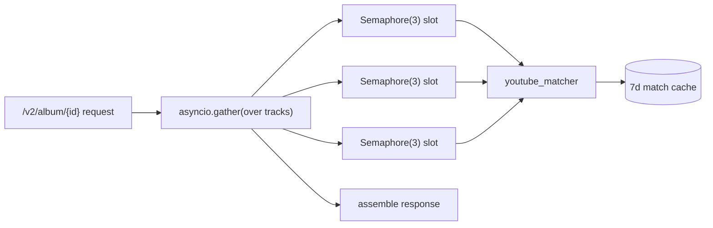

# Queue

> **Purpose**: Documents all message queues in the system — queue names, message schemas, producer/consumer relationships, and error handling strategies.
> **Update when**: A new queue is added, a message schema changes, or the queue technology changes.

> **See also**: [`workers.md`](workers.md) (the real async/edge execution model), [`services.md`](services.md) (concurrency in the hybrid pipeline), [`cache.md`](cache.md).

---

## Queue Infrastructure

> **There is no message/task queue in Paax.** No Celery, no BullMQ, no RabbitMQ, no SQS, no Redis-backed job queue, no dead-letter queues. Redis exists, but it is used **only as a cache** ([`cache.md`](cache.md)), never as a broker. The template below assumes a producer/consumer queue architecture — that architecture does not exist here.

- **Broker**: **Not applicable** — no broker.
- **Queue Library**: **Not applicable** — no queue library.
- **Hosting**: N/A.

**Why there is no queue**: Paax's backends are thin, stateless, request/response metadata and stream proxies ([`architecture`](../architecture.md), [`database-schema.md`](database-schema.md)). There is no email to send, no thumbnail to generate, no long-running fan-out job to defer. The one genuinely expensive operation — YouTube matching — is done **inline** at request time (eagerly), bounded by concurrency primitives rather than offloaded to workers. What a queue would normally provide (backpressure, retry, fan-out) is instead handled by the mechanisms below.

---

## The Real Async / Concurrency Model

This section replaces the template's queue registry with what Paax actually does to run work concurrently without a queue.

### 1. FastAPI async + `asyncio.gather` + `Semaphore` (paax-api — the important one)

The v2 hybrid pipeline fans out per-track YouTube matches **within a single request** using `asyncio.gather`, bounded by a semaphore so we never hammer YouTube:

- Main endpoints: `asyncio.Semaphore(3)`, per-track timeout **15s**.
- Hybrid services: per-track timeout **30s**.
- `/v2/chart`: `asyncio.Semaphore(5)`.

This is the semaphore acting as the "queue depth limit" a broker would give you — but synchronous to the request, with the 7-day match cache ([`cache.md`](cache.md)) absorbing repeat work instead of a DLQ absorbing failures.

### 2. `ThreadPoolExecutor` for yt-dlp

`yt-dlp` (used for YouTube search/matching in paax-api, and stream resolution in the legacy backend) is **blocking/synchronous**. To keep the event loop responsive, those calls are dispatched to a `ThreadPoolExecutor` (via `run_in_executor`) rather than blocking the async handler. This is the concurrency escape hatch for CPU/IO-bound sync libraries — not a job queue.

### 3. Fire-and-forget prefetch (legacy backend)

The legacy `backend/` `/playback/prefetch` endpoint kicks off a resolve **without awaiting the result** to warm the resolve cache before the client asks to play. This is the nearest thing to a "background job" in the codebase — an un-awaited coroutine, not a durable, retryable queue message. Detailed in [`workers.md`](workers.md).

---

## Queue Registry

**Not applicable — no queues exist.** For honesty, here is what a queue *would* have carried and where that work actually happens instead:

| Hypothetical queue | Would carry | Actually handled by |
|--------------------|-------------|---------------------|
| `match_queue` | YouTube match jobs | Inline `asyncio.gather` + `Semaphore(3/5)` in the request ([`services.md`](services.md)) |
| `resolve_queue` | Stream URL resolution | Inline / Cloudflare Worker at play time ([`workers.md`](workers.md)) |
| `prefetch_queue` | Warm-ahead resolves | Un-awaited fire-and-forget in legacy backend |
| `email_queue` / `thumbnail_queue` / `notification_queue` | Emails, image processing, notifications | **Do not exist** — Paax sends no email, generates no thumbnails server-side, sends no push notifications |

---

## Queue Specs

**Not applicable.** No message schemas, priorities, or ordering guarantees exist because no messages are enqueued.

---

## Dead Letter Queues (DLQ)

**Not applicable — no queues, no DLQs.**

Failure handling instead happens **inline**:
- Per-track match failures/timeouts are swallowed and the track is returned with `matchStatus:"low_confidence"` (or without a usable `videoId`) rather than dead-lettered — a degraded result beats a dropped request ([`services.md`](services.md)).
- Stream resolve failures map to stable error codes (`BOT_CHECK`, `GEO_BLOCKED`, etc.) via `_classify_yt_error` and are returned to the caller ([`ERROR_CODES.md`](../ERROR_CODES.md), [`workers.md`](workers.md)).

---

## Queue Monitoring

**Not applicable — nothing to monitor.** No Bull Board, no Flower, no queue depth metrics. The relevant observability is cache hit rate (`X-Cache` header, `/cache/status`) and per-request latency — see [`cache.md`](cache.md) and [`../performance.md`](../performance.md).

---

## Producing Messages

**Not applicable — nothing produces messages.** The illustrative `queue_client.enqueue(...)` from the template has no equivalent in this codebase. If future work (e.g. background catalog sync, transactional email for real accounts) ever needs deferred processing, a queue would be introduced then and documented here; today it would be premature infrastructure.

---

*Last updated: 2026-07-16*
