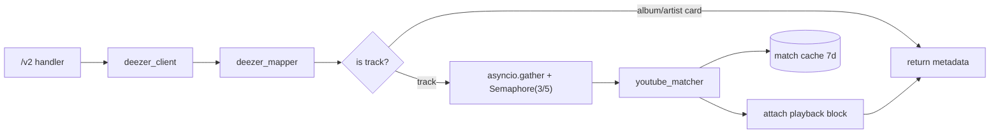

# Services

> **Purpose**: Documents all backend service classes/modules — their responsibilities, public interface, and dependencies. Agents must read this before modifying or adding a service.
> **Update when**: A new service is created, an existing service's public interface changes, or a service is deprecated.

> **See also**: [`controllers.md`](controllers.md) for the handlers that call these, [`api.md`](../api.md) for the endpoint contract, [`cache.md`](cache.md) for the caching around them, [`repositories.md`](repositories.md) for the data-access clients they sit on top of.

---

## What is a Service?

The template assumes classic `SomethingService` classes that orchestrate repositories. Paax has **no repository/DB layer** ([`repositories.md`](repositories.md)), so a "service" here is a **module of related functions** under `paax-api/services/` (and equivalents in the other apps) that:
- Fetch from an **external source** (Deezer, YouTube via yt-dlp, ytmusicapi, LRCLIB).
- **Transform** the upstream payload into Paax's normalized shape (`deezer_mapper`).
- **Orchestrate** the hybrid pipeline: metadata + eager YouTube match ([`architecture`](../architecture.md) §hybrid v2).

The "public interface" of a service is simply its **module-level functions** — there is no DI, no interface class, no `@abstractmethod`. Services are stateless except for their caches ([`cache.md`](cache.md)).

---

## Service Inventory

| Service (module) | File | Responsibility |
|---------|------|----------------|
| `deezer_client` | `paax-api/services/deezer/deezer_client.py` | HTTP access to Deezer public API (data-access layer — see [`repositories.md`](repositories.md)) |
| `deezer_mapper` | `paax-api/services/deezer/deezer_mapper.py` | Normalize Deezer payloads → Paax track/album/artist shape |
| `hybrid_search` | `paax-api/services/hybrid/hybrid_search.py` | Deezer search + per-track YouTube match orchestration |
| `hybrid_album` / `hybrid_artist` | `paax-api/services/hybrid/hybrid_album.py`, `hybrid_artist.py` | Album/artist assembly (tracks matched, cards not) |
| `youtube_matcher` | `paax-api/services/youtube/youtube_matcher.py` | Score/select best `videoId` for a track via yt-dlp `ytsearch` |
| youtube search/cache | `paax-api/services/youtube/youtube_search.py`, `youtube_cache.py` | 7-day match cache keyed by normalized artist/title/album/duration |
| lyrics logic | `paax-api/main.py` (`/lyrics` handler) | LRCLIB (synced) → ytmusicapi (plain) fallback |
| paax-stream **IPv6 proxy** | `paax-stream/app/` | Bind-to-source-IPv6 byte streaming of CDN audio |
| paax-stream **resolver stack** | `paax-stream/resolver/`, `providers/`, `services/` | **ORPHANED** multi-provider resolver (not mounted) |
| legacy yt-dlp resolver | `backend/main.py` | In-process stream URL resolution (superseded / partly broken) |

---

## Service Specs

---

### `deezer_client` (data access)

**File**: `paax-api/services/deezer/deezer_client.py`
**Dependencies**: `httpx.AsyncClient` against `https://api.deezer.com` (no API key required).

**Responsibilities**:
- Fetch tracks/albums/artists/search/chart from Deezer's free public API.
- This is Paax's closest thing to a "repository" — see [`repositories.md`](repositories.md).

**Public interface** (representative module functions):

| Function | Description |
|--------|-------------|
| `search(q, type, limit)` | Deezer `/search/{type}` |
| `get_track(id)` / `get_album(id)` / `get_artist(id)` | Entity fetch by Deezer integer id |
| `get_artist_top(id, limit)` / `get_artist_albums(id, limit)` | Artist sub-resources |
| `get_chart()` | Global chart |

> **Security flag**: the httpx client is constructed with `verify=False` — **TLS validation is disabled** on all Deezer calls. This is a real MITM risk with no upside (Deezer serves valid certs); fix by removing `verify=False`. Cross-ref [`security.md`](../security.md), [`controllers.md`](controllers.md).

---

### `deezer_mapper` (normalization)

**File**: `paax-api/services/deezer/deezer_mapper.py`
**Dependencies**: none (pure functions).

**Responsibilities**: turn raw Deezer JSON into the stable Paax contract the Flutter client expects.

**Normalized track shape**:
```json
{
  "id", "title",
  "artist": {"id", "name"},
  "artists": [{"name", "id"}],
  "album": {"id", "title", "coverUrl"},
  "duration", "explicit", "trackNumber", "discNumber",
  "source": "deezer",
  "playback": { "provider": "youtube", "engine": "iframe", "videoId", "matchConfidence", "matchStatus", "matchReason" }
}
```

**Rules encoded**: cover URL prefers `cover_xl` → `cover_big` → smaller; `explicit` from `explicit_lyrics`; album type normalized to `album`/`single`/`ep` (from `record_type`, or by `nb_tracks`: 1 = single, ≤6 = ep, else album). See [`api.md`](../api.md) for the full response contract.

---

### `hybrid_search` / `hybrid_album` / `hybrid_artist` (orchestration — core of the product)

**Files**: `paax-api/services/hybrid/hybrid_search.py`, `hybrid_album.py`, `hybrid_artist.py`
**Dependencies**: `deezer_client`, `deezer_mapper`, `youtube_matcher`, `cache` ([`cache.md`](cache.md)).

**Responsibilities**: implement the v2 pipeline — fetch clean metadata from Deezer, then attach a YouTube `videoId` to **tracks** (album/artist **cards get no matching** — nothing plays from them, so matching would be wasted cost).

**Concurrency model** (why it matters): YouTube matching is **eager** (done at request time, not deferred to a queue — see [`queue.md`](queue.md)) and each match is an expensive yt-dlp `ytsearch`. To bound cost and latency, matches run concurrently under an `asyncio.Semaphore`:
- Main endpoints: `Semaphore(3)`, per-track timeout **15s**.
- Hybrid services: per-track timeout **30s**.
- `/v2/chart`: `Semaphore(5)`.



---

### `youtube_matcher` (playback resolution)

**File**: `paax-api/services/youtube/youtube_matcher.py` (search in `youtube_search.py`, 7-day match cache in `youtube_cache.py`)
**Dependencies**: `yt-dlp` (`ytsearch`), `difflib`, match cache.

**Responsibilities**: given a Deezer track's artist/title/album/duration, find the best YouTube `videoId`.

**Scoring (0–100)**:
- **Duration**: ±60s vs. Deezer duration is a **hard reject**; closer = higher.
- **Title similarity**: `difflib` ratio.
- **Artist match**.
- **Trust signals**: `*- Topic` channel, VEVO, "Official Audio".

**Outcome**: confidence ≥ 0.5 → `matchStatus:"matched"`, else `"low_confidence"`. Result cached 7 days keyed on normalized inputs ([`cache.md`](cache.md)).

> **Why eager + scored** rather than a naive "first result": Deezer titles and YouTube uploads disagree constantly (live versions, sped-up edits, wrong durations). The duration hard-reject + trust signals keep the wrong-song rate down. The cost is latency and yt-dlp fragility — mitigated by the semaphore, timeouts, and the 7-day cache.

---

### lyrics logic

**File**: `paax-api/main.py` — the `/lyrics` handler (there is no separate `lyrics.py` module; see [`controllers.md`](controllers.md) `/lyrics`).
**Dependencies**: LRCLIB (`https://lrclib.net`), ytmusicapi.

**Responsibilities**: resolve synced or plain lyrics.
- Try LRCLIB `/api/get` (exact match), then `/api/search` (fuzzy, scored by synced-bonus + duration closeness).
- Fall back to ytmusicapi plain text.
- Returns `{lyricsAvailable, type:"synced"|"plain", source:"lrclib"|"ytmusicapi", lyrics:[{timeMs,endTimeMs,text}]}`.

---

### paax-stream — IPv6 byte proxy (deployed, not consumed)

**File**: `paax-stream/app/` (v4.0.0)
**Dependencies**: `httpx` with per-socket source binding, Redis session cache ([`cache.md`](cache.md)).

**Responsibilities**: `GET /stream?url=<cdn_url>` **proxies audio bytes** (not a redirect) from a YouTube CDN URL through a rotating pool of **16 local IPv6 source addresses** (a /124 block). Each source IPv6 carries a **sticky device fingerprint** (random UA from a 16-entry pool + harvested cookies) cached in Redis under `paax:session:<ipv6>` (TTL 1800s).

**Why this exists**: datacenter IPv4 addresses get bot-blocked by YouTube's CDN. Rotating across a /124 IPv6 block with sticky per-address fingerprints dodges per-IP rate limits. httpx binds sockets to a specific source via `AsyncHTTPTransport(local_address=ipv6)`, HTTP/2 on. Supports Range/206 (64 KiB chunks) for seeking. Host allowlist restricts targets to `*.googlevideo.com`/`youtube.com`/`ytimg.com`/`ggpht.com`. Response tags: `X-Proxy-IPv6`, `X-Provider: ipv6_proxy`.

> **Status**: deployed at `resolver.paaxmusic.app` but **the live app does not use it** — the shipping playback path plays the `videoId` directly in a YouTube IFrame. See [`architecture`](../architecture.md) and [`controllers.md`](controllers.md).

---

### paax-stream — resolver stack (ORPHANED / DEAD)

**Files**: `paax-stream/resolver/provider_manager.py`, `resolver/fallback_policy.py`, `routes/resolve.py`, `providers/{cobalt,piped,invidious,youtube_ipv6_proxy,youtube_local_mp4}`, `services/{cache_service,invidious_service,stream_selector}`.

**Status**: **NOT mounted** in `app/main.py`. This is scaffolding for a multi-provider resolver future that was never wired up:
- `fallback_policy` defines `FIRST_SUCCESS`/`PRIMARY_ONLY`, `ACTIVE_PROVIDER_ORDER=["youtube_ipv6_proxy"]`, `DISABLED_PROVIDERS=[youtube_local_mp4, cobalt, piped, invidious]`.
- `youtube_ipv6_proxy/provider.py` imports **missing modules** (`resolver.py`, `_cdn_cache.py` — only stale `.pyc` remain) and `yt_dlp` is **not in requirements** → it cannot run.
- Provider instance pools are pre-listed (cobalt `cal1/nyc1.coapi.ggtyler.dev`, `ca.haloz.at`; piped `pipedapi.tokhmi.xyz/.moomoo.me/.syncpundit.io`; invidious `invidious.nerdvpn.de`).

Document, do not resurrect, without a deliberate decision. Cross-ref [`workers.md`](workers.md).

---

### legacy backend — yt-dlp resolver (superseded)

**File**: `backend/main.py`
**Dependencies**: `yt-dlp`, in-process cache.

**Responsibilities**: `/playback/resolve` resolves a direct stream URL:
- **PATH1**: audio-only mp4/m4a/AAC (reject webm/opus/DASH/`sq=`), pick by content-length then bitrate.
- **PATH2**: muxed mp4 fallback.
- `_classify_yt_error` → stable codes `BOT_CHECK`/`GEO_BLOCKED`/`VIDEO_UNAVAILABLE`/`FORMAT_UNAVAILABLE`/`NETWORK_ERROR`/`RESOLVE_FAILED`.

`/stream/{videoId}` in the same service is **broken** (`NameError: _FORMAT_FALLBACKS`). The whole service is superseded by paax-api. Cross-ref [`workers.md`](workers.md), [`ERROR_CODES.md`](../ERROR_CODES.md).

---

## Inter-Service Communication

- **Pattern**: **direct in-process function calls** within each FastAPI app (synchronous imports; `await` for I/O). There is **no event bus and no message queue** ([`queue.md`](queue.md)) — "inter-service" here means calling another module in the same process.
- **Across the three Python apps**: they do **not** call each other. They are independent deployments; the Flutter client is the only thing that fans out to them (and today only to paax-api).
- **Circular dependencies**: avoided naturally by the one-directional module layout (`hybrid/` → `deezer/` + `youtube/`, never the reverse).

---

## Service Layer Rules

Mapped to reality:
- **Stateless**: services hold no per-request mutable state; the only state is the shared caches ([`cache.md`](cache.md)).
- **No DB clients**: correct by construction — there is no DB ([`database-schema.md`](database-schema.md)); data access is via the external-API clients in [`repositories.md`](repositories.md).
- **Documentation comments**: partially present; new/changed functions should carry docstrings per [`coding-standards.md`](../coding-standards.md).
- **Error codes**: only the legacy backend's `_classify_yt_error` uses a stable code set ([`ERROR_CODES.md`](../ERROR_CODES.md)); paax-api leaks `str(e)` — a gap to close ([`controllers.md`](controllers.md)).

---

*Last updated: 2026-07-16*
