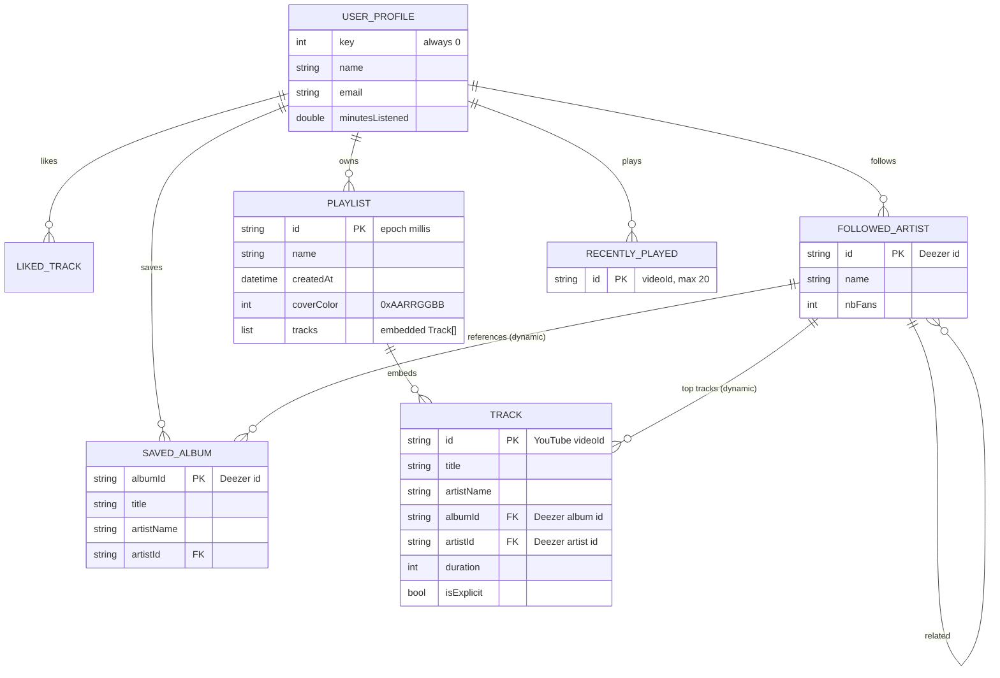

# Database

> **Purpose**: Documents the database schema, relationships, migration history, and conventions. Agents must read this before writing any database-related code.
> **Update when**: A schema migration is created, an index is added, or a naming convention changes.

---

## Database System

As of 2026-07-16 there are **two persistence layers** (see [decisions.md](decisions.md) ADR-009):

### (a) Supabase Postgres — deployed foundation (Phase 1, NOT yet consumed)

A hosted Supabase project (`jecgmiuypuathhvjuhea`) now carries the full server schema — **34 tables with RLS enabled on every one**, 6 views, `security definer` helpers in a non-exposed `private` schema, uuid PKs (`gen_random_uuid()`), **text + CHECK constraints instead of Postgres enums**, trigger-maintained denormalized counters, and versioned migrations in `supabase/migrations/` (11 files). The complete reference — every table, index, policy, function, view, and Storage bucket — is [backend/database-schema.md](backend/database-schema.md).

> **Critical status note**: this layer is **deployed but consumed by nothing**. Flutter still runs on Hive + the demo auth stub, `paax-api` is unchanged, and there are no ingestion/matching jobs. Integration is Phase 2+ (ADR-009 rollout plan).

### (b) Client-side Hive — the LIVE local cache (now cloud-synced)

Hive remains the **live local datastore** on the user's device, and everything below still accurately describes its shape. **As of Phase 3.2A (2026-07-17)** it is the fast **offline-first cache** in front of Supabase: the library (liked / saved albums / followed artists / hidden tracks) is now **synced to Supabase** as the cross-device authority (identity/profile since Phase 3.1). Playlists, recent searches, and the residual local profile stay Hive-only for now. See [features/library.md](features/library.md), [decisions.md](decisions.md) ADR-011.

- **Engine**: **Hive** ^2.2.3 (`hive_flutter` ^1.1.0) — a pure-Dart, key-value, box-based embedded store.
- **Hosting**: On-device (app documents directory). Library entities are pushed best-effort to Supabase; playlists/searches are not uploaded.
- **ORM / Query Builder**: None — direct box access through `HiveStorage` (`frontend/lib/data/local/hive_storage.dart`; `clearLibraryBoxes` supports multi-account isolation).
- **Migration Tool**: None. Schema evolution is handled with typed adapters (`hive_generator`) plus **imperative one-time migrations** in `HiveStorage.init()` (currently de-duplication passes). `Track` field additions append `@HiveField` indices — `deezerTrackId` (11) is the latest, additive/backwards-compatible.

> The `.claude/rules/database.md` and `.claude/rules/supabase.md` describe a Postgres/Supabase design (UUIDs, RLS, migrations, FKs). Since Phase 1 (2026-07-16) they **describe reality for the server layer** — the deployed schema follows them (with one documented deviation: rollbacks are documented drops, not down-files, since Supabase migration history is forward-only). They do not apply to the Hive layer, which this document describes.

---

## Naming Conventions

Hive has no tables/columns; the analogous concepts are **boxes** (collections) and **fields** (`@HiveField` indices). Conventions in use:

| Element | Convention | Example |
|---------|-----------|---------|
| Box name | `snake_case`, plural, declared as `static const` | `liked_tracks`, `saved_albums` |
| Entity class | `PascalCase`, annotated `@HiveType(typeId:n)` | `Track`, `SavedAlbum` |
| Field index | Stable `@HiveField(n)` — **never renumber** existing fields | `@HiveField(0) id` |
| Box key | The entity's natural id (`track.id`, `playlist.id`, `albumId`, `artist.id`) | upsert-by-id |
| Type id | Globally unique small int per `@HiveType` | 0=Track … 4=Artist |

**Golden rule:** `@HiveType.typeId` and `@HiveField` numbers are a wire format. Adding a field = append a new index. Removing one = retire the index, never reuse it. Renumbering corrupts every existing user's stored data.

---

## Schema Overview

| Box (typeId) | Entity | Key | Stores |
|--------------|--------|-----|--------|
| `liked_tracks` (0) | `Track` | `track.id` | Liked songs |
| `recently_played` (0) | `Track` | `track.id` | Last 20 played (upsert, capped) |
| `playlists` (1) | `Playlist` | `playlist.id` | User playlists (embed `Track`s) |
| `saved_albums` (2) | `SavedAlbum` | `albumId` | Saved albums |
| `user_profile` (3) | `UserProfile` | `0` (single) | Local profile |
| `followed_artists` (4) | `Artist` | `artist.id` | Followed artists |
| `recent_searches` | `String` | auto | Last 10 queries |
| `settings` | untyped | string keys | Onboarding flag, hidden tracks, pinned playlists |
| `stream_candidates` | untyped | — | Declared for a stream-URL cache; **currently unused** |

`Track.id` holds the **YouTube `videoId`** (the v2 playback key), not the Deezer id — this is central to how playback works (see [features/player.md](features/player.md)).

---

## Table Definitions (Hive entities)

### `Track` — `@HiveType(typeId: 0)`

The core media object. All 12 fields persist.

| Field | Idx | Type | Nullable | Description |
|-------|-----|------|----------|-------------|
| `id` | 0 | `String` | No | **YouTube videoId** (playback key in v2) |
| `title` | 1 | `String` | No | Track title |
| `artistName` | 2 | `String` | No | Joined display string ("A, B") |
| `albumId` | 3 | `String` | No | Deezer album id |
| `albumTitle` | 4 | `String` | No | Album title |
| `artworkUrl` | 5 | `String` | No | Cover URL |
| `previewUrl` | 6 | `String?` | Yes | Always null in v2 |
| `duration` | 7 | `int` | No | Seconds |
| `artistId` | 8 | `String?` | Yes | Primary artist id |
| `artists` | 9 | `List<Map<String,String>>?` | Yes | Structured `{name,id}` per artist |
| `isExplicit` | 10 | `bool` | No | Explicit flag |
| `deezerTrackId` | 11 | `String?` | Yes | **Deezer track id** (Phase 3.2A, additive/backwards-compatible; sourced from the v2 payload's top-level id in `_mapTrackV2`). Lets cloud sync resolve a local track to `tracks.id` via `CatalogResolver` — see [features/library.md](features/library.md) |

### `Playlist` — `@HiveType(typeId: 1)`
`id`(0), `name`(1), `tracks`(2 `List<Track>` embedded), `createdAt`(3 `DateTime`), `coverColor`(4 `int?` `0xAARRGGBB`). All persist. See [features/playlist.md](features/playlist.md).

### `SavedAlbum` — `@HiveType(typeId: 2)`
**Persisted (0–4)**: `albumId`, `title`, `artistName`, `artworkUrl`, `artistId?`. **Runtime-only (not persisted)**: `releaseDate`, `label`, `duration`, `trackCount`, `tracks`, `releaseType`, `artists`. The detailed fields are re-fetched from `/v2/album/{id}` when an album is opened, so only the lightweight card fields are stored. See [features/albums.md](features/albums.md).

### `UserProfile` — `@HiveType(typeId: 3)`
`name`(0), `email`(1), `minutesListened`(2 `double`, mutable). Single instance stored at box key `0`. See [features/profile.md](features/profile.md).

### `Artist` — `@HiveType(typeId: 4)`
**Persisted (0–7)**: `id`, `name`, `picture`, `nbFans`, `albums`(`List<dynamic>`), `singles`, `topTracks`, `relatedArtists`(`List<Artist>`, recursive). **Not persisted**: `albumsParams`, `singlesParams` (pagination hints). `albums/singles/topTracks` are typed `dynamic` to avoid a circular Hive-gen dependency with `SavedAlbum`.

### `settings` box (untyped keys)
`onboarding_completed` (`bool`), `hidden_track_ids` (`List<String>`), `pinned_playlist_map` (`Map<playlistId,pinnedAtMillis>`, max 5).

---

## Relationships

Hive is key-value, so "relationships" are **embedding + id references**, not foreign keys.

`albumId`/`artistId` on `Track`/`SavedAlbum` reference Deezer ids on the **paax-api** side, not local rows — resolution happens by calling `/v2/album/{id}` or `/v2/artist/{id}`. See [api.md](api.md).

---

## Migration History

### Server (Supabase) — SQL migrations now exist

Phase 1 (2026-07-16) introduced 11 versioned SQL migrations in `supabase/migrations/`, applied via the Supabase MCP and mirrored 1:1 in the repo (full contents in [backend/database-schema.md](backend/database-schema.md)):

`20260716090000_extensions_and_helpers` · `20260716090100_catalog` · `20260716090200_profiles_and_auth` · `20260716090300_library_and_social` · `20260716090400_playlists` · `20260716090500_stories` · `20260716090600_billing` · `20260716090700_notifications` · `20260716090800_catalog_views` · `20260716090900_storage_buckets` · `20260716091000_storage_tighten_listing`

Phase 3.2A (2026-07-17) added `20260717160000_phase3_2a_onboarding_and_hidden_tracks` — the `user_hidden_tracks` table (own-row RLS + FK index) and the `complete_artist_onboarding(uuid[])` SECURITY DEFINER RPC that flips `profiles.onboarding_completed`. Full detail: [backend/database-schema.md](backend/database-schema.md).

### Client (Hive)

No SQL migrations. Data-shape migrations are imperative, run once at `HiveStorage.init()`:

| # | Name | Date | Description |
|---|------|------|-------------|
| 001 | `_deduplicateLikedTracks` | (shipped 2026) | Collapse duplicate liked rows from old auto-key `.add()` saves; keep the entry with the richest `artists` list; re-key strictly by `track.id` |
| 002 | `_deduplicateRecentlyPlayed` | (shipped 2026) | Same de-dup for `recently_played` |

Future field additions must append `@HiveField` indices; a corresponding migration is only needed if defaults are insufficient. Reversibility is not a Hive concept (there is no shared DB to roll back).

---

## Backup & Recovery

- **Backup frequency**: As of Phase 3.2A the **library** (liked / saved albums / followed artists / hidden tracks) is durably synced to Supabase, so a re-login re-hydrates it cross-device (`hydrateFromCloud`, add-only). Logout no longer wipes Hive (Phase 3.1); the Profile "Clear Data" action still wipes the local cache but **not** the cloud — the same user re-hydrates on next login (see [KNOWN_ISSUES.md](KNOWN_ISSUES.md)). **Playlists and the residual local profile remain Hive-only** and are still lost on uninstall/clear-data until playlist cloud migration lands.
- **Retention**: Cloud-synced entities persist server-side; playlists/searches until uninstall / clear-data.
- **Restore process**: Automatic cloud re-hydration for synced entities on login. No manual export/import yet ([IDEAS.md](IDEAS.md) tracks adding one).

For the **Redis** caches on the server side (not a system of record), backup is irrelevant — entries are TTL'd and regenerated on miss. See [CACHE_STRATEGY.md](CACHE_STRATEGY.md).

---

## Database Improvements & Indexing (Architecture Review, 2026-07-16)

From the [Architecture Review](architecture-review.md) §4 (Indexes) and §8 (Database):

- **Add a `schemaVersion` + ordered migration framework** — evolution is currently imperative de-dup passes in `HiveStorage.init()` (`AR-DB-01`).
- **Split card vs detail models** — `SavedAlbum` persists 5 fields but carries 7 runtime-only ones; separate a persisted `AlbumCard` from a transient `AlbumDetail` (`AR-DB-02`).
- **Remove `List<dynamic>` from `Artist`** — store references/ids or split boxes (`AR-DB-03`, `AR-MA-04`).
- **Export/import** — no backup path exists; add JSON export/import as a stopgap before sync (`AR-DB-04`).
- **Client "indexing"** — `LibraryController._loadData()` reloads all boxes and sorts/filters in memory on every mutation (O(n) per change); maintain in-memory indexes or move to a queryable store (Isar/Drift) if the library grows large (`AR-IDX-01`, `AR-DB-06`).
- **Future server schema** — ✅ superseded: [decisions.md](decisions.md) **ADR-009** (2026-07-16) adopted Supabase and the Phase 1 schema is deployed (uuid PKs, FKs, timestamps, indexed FKs/filter columns — see [backend/database-schema.md](backend/database-schema.md)). The remaining work is *integration + Hive migration* (Phases 2–3), not schema design (`AR-DB-05`, `AR-IDX-03`).

Full detail: [architecture-review.md](architecture-review.md#8-database-improvements).

---

## Phase 3.4.1 — Cloud Playlists schema (2026-08-02)

Additive migrations (`supabase/migrations/20260801120000..130100`). Playlist
tables were empty before this phase (zero data risk). **Positions are one-based**
(`playlist_tracks.position > 0` check retained).

**`playlists`** (additive columns): `version bigint` (optimistic concurrency,
RPC-bumped one per grouped op), `last_modified_at`/`last_modified_by` (meaningful
edits only), `deleted_at` (soft delete), `cover_mode` (`generated`|`custom`),
`custom_cover_url`, `source_playlist_id` (clone provenance). Counters
`total_tracks`/`total_duration_seconds` (trigger `refresh_playlist_totals`) and
`platform_followers_count` (trigger `bump_playlist_followers`) are
trigger-maintained — never client-trusted.

**`playlist_tracks`**: `id uuid` PK, `updated_at`; `unique(playlist_id,position)`
**deferrable initially deferred** (transactional reorder), `unique(playlist_id,
track_id)` (no dup tracks).

**`playlist_collaborators`** (PK `playlist_id,user_id`): invitation lifecycle
`status` (`pending`/`accepted`/`declined`/`removed`/`left`), `invited_by`,
`invited_at`, `accepted_at`, `joined_at`, `updated_at`, `role`
(`editor`/`moderator`/`viewer`).

**`playlist_activity`** (new, append-only): `id, playlist_id (fk cascade),
actor_id, event_type, created_at, playlist_version, metadata jsonb,
grouped_change_id`. RLS: SELECT via `private.can_view_playlist`; **no
INSERT/UPDATE/DELETE policy** → only trusted RPCs write.

**`user_blocks`** (new, minimal seam): `blocker_id, blocked_id, created_at`
(PK both, `blocker_id<>blocked_id` check). RLS: users manage only their own rows.

**Helpers** (`private`, SECURITY DEFINER, `search_path=''`, execute revoked):
`can_view_playlist` (public/unlisted → all; owner/pending+accepted collaborator/
`followers`-friend → view; blocked/soft-deleted denied), `can_edit_playlist`
(owner or **accepted** editor/moderator, not blocked, not deleted),
`is_playlist_owner`, `is_blocked` (symmetric), `log_playlist_activity`,
`handle_owner_account_deletion` (succession).

**Realtime**: `playlists`, `playlist_tracks`, `playlist_collaborators`,
`playlist_activity` added to the `supabase_realtime` publication (RLS still
governs delivery).

See [security](security.md) for the RPC/RLS model and [playlist](features/playlist.md)
for the domain/policy documentation.

---

## Phase 3.4.1.1 — Notification inbox extensions (2026-08-03)

Additive migration `20260803090000_phase3_4_1_1_notifications` extends the
pre-existing `notifications` table (from Phase 1 `..090700_notifications`) — no
new table.

**`notifications`** (additive columns): `actor_user_id uuid` (who caused it),
`entity_type text` + `entity_id uuid` (target, e.g. `playlist`), `acted_at
timestamptz` (invite resolved/revoked → no longer actionable), `dedupe_key text`,
`deleted_at timestamptz` (soft delete). Indexes: partial-unique
`notifications_dedupe_uidx (user_id, dedupe_key) where dedupe_key is not null and
deleted_at is null` (a re-invite refreshes one row, never stacks), and
`idx_notifications_user_created (user_id, created_at desc)`. Added to the
`supabase_realtime` publication.

**RLS** (unchanged shape, verified): SELECT/UPDATE/DELETE own-rows-only
(`auth.uid() = user_id`), **no INSERT policy** → clients cannot create
notifications (a direct client INSERT fails under RLS).

**Helpers** (`private`, SECURITY DEFINER, execute revoked from all client roles):
`emit_playlist_notification(recipient, actor, type, playlist_id, dedupe)` builds a
display-safe payload (playlist title/cover + actor username; **no private track
data**) and upserts on the dedupe key; `revoke_invite_notification(recipient,
playlist_id)` marks a pending invite notification `acted` when the invite is
revoked. Both are called **inside** the collaboration RPCs
(`playlist_invite_collaborator`, `playlist_respond_invitation`, `playlist_leave`,
`playlist_remove_collaborator`, `playlist_transfer_ownership`) in the same
transaction — so a notification exists iff the mutation committed.

Notification types: `playlist_collaboration_invited` / `_accepted` / `_declined`,
`playlist_collaborator_removed` / `_left`, `playlist_ownership_transferred`.

---

## Phase 3.4.1.2 — Follow notifications (2026-08-04)

Additive migration `20260804090000_phase3_4_1_2_follow_notifications` — **no
schema change**, redefines two functions:

- `private.emit_playlist_notification` now selects the actor's avatar
  (`coalesce(avatar_url, avatar_original_url)`) into the payload as `actor_avatar`
  and knows the `playlist_followed` / `playlist_unfollowed` copy. Still
  `SECURITY DEFINER`, `EXECUTE` revoked from all client roles.
- `public.playlist_set_follow` emits one `playlist_followed` to the owner on a
  **new** follow (`FOUND`-gated after `insert … on conflict do nothing`), never
  to self, deduped by `pl_follow:<pid>:<follower>`. Unfollow emits nothing
  (product decision). The follower counter is still maintained solely by the
  pre-existing `bump_playlist_followers` trigger, which writes only
  `platform_followers_count` — following never updates `updated_at` /
  `last_modified_at` / `last_modified_by`.

New notification type: `playlist_followed`. (`playlist_unfollowed` copy exists but
is never emitted.)

**Integrity snapshot (read-only audit, 2026-08-04):** 3 playlists — 1 live valid
owned, 2 owner-soft-deleted; 0 orphan child rows across
`playlist_tracks`/`user_followed_playlists`/`playlist_collaborators`/
`playlist_activity`/notification refs; 0 counter mismatches. No cleanup performed.

---

*Last updated: 2026-08-04*
