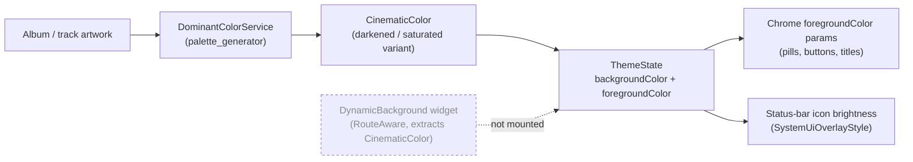

# Colors

> **Purpose**: Documents all color tokens used in the application — brand colors, semantic colors, surface colors, and their values. Paax is **dark-only**, so there are no light-mode values.
> **Update when**: A color token is added, removed, or its value changes.

---

## Rules

- **Prefer named tokens over raw hex.** All canonical colors live in `AppColors` (`frontend/lib/core/theme/app_colors.dart`). New surfaces/text should reference them.
- **Reality check:** the codebase still contains hardcoded hex in places (see [Known hardcoding inconsistencies](#known-hardcoding-inconsistencies)). Treat those as debt, not precedent.
- The app is **dark-only** — there is no light-mode value for any token. `ThemeState` supplies *ambient* artwork-derived colors, not a second theme.
- Contrast: white text on `#080808`/`#111111` clears WCAG AA comfortably; **artwork-tinted foregrounds** are the risk area and rely on adaptive contrast logic (see below).

See also: [design-system.md](design-system.md), [typography.md](typography.md), [frontend/theming.md](../frontend/theming.md).

---

## Brand Colors

Source: `AppColors` (`frontend/lib/core/theme/app_colors.dart`). Single dark palette — no light values exist.

| Token | Value | Notes |
|-------|-------|-------|
| `AppColors.primaryStart` | `#FFFFFF` | White; start of the brand gradient. Also `ColorScheme.primary`. |
| `AppColors.primaryEnd` | `#FF0055` | Hot-pink accent; end of the brand gradient. Also `ColorScheme.secondary`. The app's one true accent color. |
| `AppColors.secondary` | `#9D4EDD` | Legacy purple. **Mostly unused** — retained for compatibility; do not reach for it in new UI. |
| `AppColors.primaryGradient` | `#FFFFFF → #FF0055` | `LinearGradient` (topLeft → bottomRight). Applied via `Ink`/`ShaderMask` at call sites for primary buttons and accents. |

```dart
static const LinearGradient primaryGradient = LinearGradient(
  colors: [primaryStart, primaryEnd],       // white → #FF0055
  begin: Alignment.topLeft,
  end: Alignment.bottomRight,
);
```

---

## Semantic Colors

**Not applicable as tokens** — Paax has **no dedicated semantic color palette** (`success`/`warning`/`info`). Error/destructive UI is expressed through:

- `AppColors.primaryEnd` (`#FF0055`) used loosely as an alert/destructive accent, and
- `error_state_widget.dart`, which classifies error strings into an icon + retry affordance rather than a color token.

| Concept | How it's expressed today | Recommendation |
|---------|--------------------------|----------------|
| Success | Ad-hoc (usually plain white text / snackbar) | Add `AppColors.success` |
| Warning | None | Add `AppColors.warning` |
| Error / destructive | `#FF0055` accent + `error_state_widget` | Introduce a distinct `AppColors.error` so destructive ≠ brand |
| Info | None | Add `AppColors.info` |

> **Recommendation (target state):** Introduce a proper semantic set so destructive actions are not visually identical to the brand accent.

---

## Surface Colors

Source: `AppColors`. Note the surface palette is intentionally **flat** — three tokens all resolve to the same charcoal.

| Token | Value | Purpose |
|-------|-------|---------|
| `AppColors.background` | `#080808` | Page/screen background (`scaffoldBackgroundColor`, `ColorScheme.background`). Near-black. |
| `AppColors.surface` | `#111111` | Cards, glass surfaces, sheets (`ColorScheme.surface`). |
| `AppColors.elevatedSurface` | `#111111` | Alias of `surface`. No real elevation delta. |
| `AppColors.surfaceLight` | `#111111` | Alias of `elevatedSurface`. Same value. |
| Scrim (player) | `black @ ~55%` | Only in `player_screen.dart`, over the blurred artwork behind the `BackdropFilter`. |
| Glass border | `white @ 0.08`, 0.5px | The signature "liquid glass" rim on every surface (`BeatyGlassTokens.borderOpacity = 0.08`, `borderWidth = 0.5`). |

> The lack of an elevation ladder (all surfaces = `#111111`) is deliberate for the flat cinematic look, but it means depth is communicated **only** by borders and shadows, not by lightness steps.

---

## Text Colors

| Token | Value | Purpose |
|-------|-------|---------|
| `AppColors.textPrimary` | `#FFFFFF` | Primary/body text; display & headline styles. |
| `AppColors.textSecondary` | `white @ 70%` (`Colors.white70`) | Secondary text; `bodyMedium` in the theme. |
| `AppColors.mutedText` | `#8A8A8A` | Tertiary/muted metadata (~white54 equivalent). |
| Text on accent/light chip | `black` | e.g. selected `GlassChip` uses black text on a white@0.88 fill. |
| Adaptive foreground | `ThemeState.foregroundColor` | Artwork-derived; passed as `foregroundColor` params into chrome so controls stay legible over any header. |

There is no distinct `disabled` text token; disabled/dimmed states are done by opacity at call sites (e.g. hidden tracks render dimmed).

---

## Border / Divider Colors

| Token | Value | Purpose |
|-------|-------|---------|
| Glass rim | `white @ 0.08`, 0.5px | Default border on `BeatyGlassSurface`, `GlassChip`, `GlassCircleButton`, `GlassMenuButton`. The single most-used border in the app. |
| Inner highlight | `white @ 0.06` | `BeatyGlassTokens.highlightOpacity` — subtle inner-highlight gradient strength (largely nominal since blur is off). |
| Dividers | Ad-hoc | No divider token; dividers are drawn with low-opacity white where needed. |

There is **no focus-ring token** — focus states are not visually styled (a known accessibility gap for keyboard/web).

---

## Dynamic Album-Color Pipeline

This is the most distinctive part of Paax's color system: chrome adapts to the **currently displayed artwork**.



- `DominantColorService` (`frontend/lib/core/utils/dominant_color_service.dart`) extracts a dominant color from artwork (via `palette_generator`) and derives a **`CinematicColor`** — a darkened/adjusted variant tuned to sit behind white/near-white text.
- The color is pushed into `ThemeState`, which exposes `backgroundColor` and an **adaptive `foregroundColor`** (light or dark) chosen for contrast against that background, plus status-bar icon brightness.
- Detail screens (album/artist/playlist) take a **static, pre-blurred artwork header** and layer `DynamicEdgeFade.dynamic(color: ...)` gradients tinted with the ambient color so content fades into the surface.

> **Dormant:** `DynamicBackground` (`frontend/lib/presentation/widgets/dynamic_background.dart`) is a `RouteAware` widget that would drive `ThemeState` live as routes change. It is **implemented but not mounted by any screen**. The adaptive `foregroundColor` still flows through screens that pass it explicitly. See [design-system.md](design-system.md#theme-system).

---

## Known Hardcoding Inconsistencies

Flag these when touching related code:

- **`#121212` vs `#080808` vs `#111111`.** The nominal background token is `#080808`, but `DynamicEdgeFade.black` and `TopFadeGradient` hardcode `#121212`, and several comments in `glass_surface.dart` mistakenly refer to the background as `#121212`. Net effect: three near-blacks coexist. Prefer `AppColors.background` and treat `#121212` fades as legacy.
- **Aliased surfaces.** `surface`, `elevatedSurface`, and `surfaceLight` are all `#111111` — code that varies between them communicates no visual difference today.
- **Inlined `white.withOpacity(0.08)` borders** appear literally in many widgets instead of referencing `BeatyGlassTokens.borderOpacity`.

> **Recommendation:** Route all fades and borders through `AppColors` / `BeatyGlassTokens`; delete the `#121212` literals.

---

## Color Implementation

```dart
// Preferred: reference AppColors (the canonical palette)
import 'package:beaty/core/theme/app_colors.dart';

Container(color: AppColors.surface)                    // #111111 card/glass fill
Text('Now playing', style: TextStyle(color: AppColors.textPrimary))

// Brand accent / gradient
DecoratedBox(decoration: BoxDecoration(gradient: AppColors.primaryGradient))

// Adaptive-over-artwork: use the ambient foreground from ThemeState
final fg = context.watch<ThemeState>().foregroundColor;
Icon(Icons.play_arrow, color: fg)
```

---

## Contrast Audit

Static palette combinations (approximate ratios):

| Combination | Ratio | WCAG AA (text) |
|-------------|-------|----------------|
| `textPrimary #FFFFFF` on `background #080808` | ~20.4:1 | ✅ |
| `textPrimary #FFFFFF` on `surface #111111` | ~18.9:1 | ✅ |
| `textSecondary white70` on `surface #111111` | ~13:1 (effective) | ✅ |
| `mutedText #8A8A8A` on `background #080808` | ~5.6:1 | ✅ (normal text) |
| `mutedText #8A8A8A` on `surface #111111` | ~5.2:1 | ✅ (normal text) |
| White text on **artwork-tinted** header | Variable | ⚠️ Depends on `CinematicColor` darkening + adaptive `foregroundColor` |

> The static palette is safe. The **only** contrast risk is text/icons over artwork-derived backgrounds; that is exactly what the adaptive `foregroundColor` in `ThemeState` mitigates. There is no automated contrast test — verify visually on bright/pastel artwork.

---

*Last updated: 2026-07-16*
