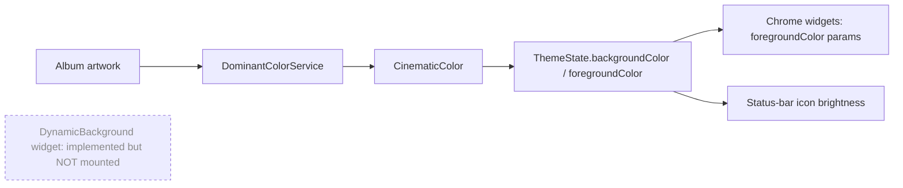

# Design System

> **Purpose**: The master reference for the visual design system — all design tokens, component conventions, and the philosophy behind them. Start here before working on any UI.
> **Update when**: A new design token category is added, the design system tool changes, or a fundamental visual direction shifts.

---

## Overview

Paax has **no external design system**. There is no Figma file, no design-token package, no Style Dictionary, and no design-to-code handoff pipeline. **Code is the single source of truth.** The "design system" is a small set of Dart constants plus a body of custom Flutter widgets that encode a deliberate aesthetic. This document describes that reality — not an aspirational one — and flags where the system is immature so it can be hardened later.

The aesthetic is **"Cinematic Black / Liquid Glass"**: a dark, content-first surface where album artwork bleeds edge-to-edge behind translucent-looking chrome, and content appears to dissolve under floating controls via gradient edge fades. Critically, the "glass" is **simulated, not real** — see [Theme System](#theme-system) below.

- **Design Tool**: **None.** No Figma / Penpot / Sketch. Visual decisions live in code and commit history (see [decisions](../decisions.md), [release-notes](../release-notes.md)).
- **Design Tokens**: Code-defined only, split across three files:
  - `AppColors` — `frontend/lib/core/theme/app_colors.dart` (color palette + brand gradient). See [colors.md](colors.md).
  - `BeatyGlassTokens` — `frontend/lib/presentation/widgets/glass_surface.dart` (surface radius, border, shadow, tint tokens). See [components.md](components.md).
  - `Responsive` — `frontend/lib/core/utils/responsive.dart` (breakpoints + adaptive sizing helpers). See [responsive.md](responsive.md).
  - There is **no** central spacing/typography token file. See [spacing.md](spacing.md) and [typography.md](typography.md).
- **Component Library**: **Custom Flutter widgets** under `frontend/lib/presentation/widgets/`, layered on top of Material 3. There is no third-party component kit. See [components.md](components.md) and [frontend/widgets.md](../frontend/widgets.md).
- **Icon Library**: **Material Icons** (Flutter's `Icons` class) for the bulk of UI, plus a handful of **custom SVGs** rendered via `flutter_svg` for the primary nav (Home/Search). See [icons.md](icons.md).

---

## Core Principles

These are reverse-engineered from the code and commit history — they are conventions the codebase follows, not a published charter.

1. **Cinematic black.** The app is **dark-only**. Backgrounds are near-black (`#080808`), surfaces are a single flat charcoal (`#111111`). There is no light theme and no theme toggle — `ThemeState` is an *ambient color* holder, not a light/dark switch.
2. **Content dissolves under chrome.** Album/artist artwork forms the visual backdrop of detail screens; floating controls sit above it and the content scrolls *under* them, faded out by gradient `DynamicEdgeFade` overlays rather than hard bars. The effect is "content melting into the surface," not "content in a boxed card."
3. **Restraint in accent.** A single hot-pink accent (`#FF0055`) and a white→pink `primaryGradient` carry all brand emphasis. The legacy purple `secondary` (`#9D4EDD`) is essentially unused. Orange accents were deliberately removed (see [release-notes](../release-notes.md)).
4. **Hierarchy through weight, not size.** The type system leans on heavy Roboto weights (w700–w900) for display/headline and lets Material's scale do the rest. See [typography.md](typography.md).
5. **Performance is a design constraint.** Real blur (`BackdropFilter`) is disabled everywhere except the full player, because it is expensive on low-end Android and Flutter Web. The glass look is faked with solid fills + borders + shadows + static blurred-artwork headers. See [Theme System](#theme-system).

---

## Token Categories

| Category | File | Description |
|----------|------|-------------|
| Colors | [`colors.md`](colors.md) | `AppColors` palette, brand gradient, dynamic album-color pipeline |
| Typography | [`typography.md`](typography.md) | google_fonts Roboto, Material 3 text theme, weight scale |
| Spacing | [`spacing.md`](spacing.md) | **No formal scale** — ad-hoc literals + `Responsive` helpers |
| Components | [`components.md`](components.md) | Custom widget catalog and specs |
| Animations | [`animations.md`](animations.md) | Real durations/curves in use, reduce-motion gaps |
| Icons | [`icons.md`](icons.md) | Material Icons + custom SVG nav icons |
| Responsive | [`responsive.md`](responsive.md) | `Responsive` breakpoints + adaptive helpers |

See also the frontend engineering docs: [frontend/theming.md](../frontend/theming.md) and [frontend/widgets.md](../frontend/widgets.md).

---

## Theme System

The theming implementation is documented in depth in [frontend/theming.md](../frontend/theming.md). Summary of what matters for the design system:

- **Supported themes**: **Dark only.** `MaterialApp.theme` is always `AppTheme.darkTheme` (`frontend/lib/core/theme/app_theme.dart`), a Material 3 `ThemeData` with `brightness: dark` and `ColorScheme.dark(...)`. There is no light `ThemeData` anywhere.
- **Theme implementation**: A single `AppTheme.darkTheme` `ThemeData`. Font family is locked to google_fonts **Roboto** globally (to defeat OEM system-font overrides). `ColorScheme.dark` maps `primary → #FFFFFF`, `secondary → #FF0055`, `surface → #111111`, `background → #080808`.
- **Theme switching**: **None.** `ThemeState` (`frontend/lib/presentation/state/theme_state.dart`) is **not** a light/dark toggle — it is a `ChangeNotifier` holding an ambient `backgroundColor`/`foregroundColor` derived from the current album artwork, plus status-bar icon brightness. It exists to let chrome adapt its contrast to whatever artwork is on screen.
- **The "glass" is fake.** `BlurCapability.canBlur()` **always returns false** and `forceSolidGlass = true`. Every "glass" widget renders as a **solid `#111111` surface + white@0.08, 0.5px border + soft drop shadow**. The liquid-glass illusion comes from: (a) static, pre-blurred album-artwork headers on detail screens, (b) `DynamicEdgeFade` gradient overlays, and (c) the solid dark chrome floating over them. The **only** live `BackdropFilter` in the app is in `player_screen.dart` (`ImageFilter.blur(sigmaX: 55, sigmaY: 55)` over the blurred artwork with a ~55% scrim).

> **Note (dormant):** The `DynamicBackground` widget that would push extracted colors live into `ThemeState` is implemented but **not mounted by any screen**. Contrast still flows through many widgets via explicit `foregroundColor` parameters. See [colors.md](colors.md#dynamic-album-color-pipeline).

---

## Token Mapping (code ↔ concept)

There is no Figma to map to. Instead, this table maps design concepts to the code that owns them.

| Design concept | Code owner | Location |
|----------------|-----------|----------|
| Color palette / brand gradient | `AppColors` | `frontend/lib/core/theme/app_colors.dart` |
| Global theme / type theme | `AppTheme.darkTheme` | `frontend/lib/core/theme/app_theme.dart` |
| Ambient (artwork-derived) color | `ThemeState` | `frontend/lib/presentation/state/theme_state.dart` |
| Surface / glass tokens | `BeatyGlassTokens`, `GlassTokens` | `frontend/lib/presentation/widgets/glass_surface.dart` |
| Breakpoints + adaptive sizing | `Responsive` | `frontend/lib/core/utils/responsive.dart` |
| Surface primitives | `BeatyGlassSurface`, `GlassPill`, `GlassChip`, `GlassCircleButton` | `frontend/lib/presentation/widgets/glass_surface.dart` |
| Edge fades | `DynamicEdgeFade` | `frontend/lib/presentation/widgets/glass_surface.dart` |

---

## Design Review Process

There is no formal design review (no designer, no Figma sign-off). The de facto process is:

1. A visual change is prototyped directly in Flutter against the running app.
2. It is tuned iteratively (many commits are literal "shadow/edge/opacity tuning" passes — see [release-notes](../release-notes.md)).
3. Gates are engineering-only: `flutter analyze` + `dart format` (there are **no** widget/golden tests — see [tasks/backlog](../tasks/backlog.md)).
4. Tokens *should* be updated first, then components should reference them — but in practice many values are still inlined literals (see recommendation below).

> **Recommendation (target state):** Introduce a single `AppSpacing`/`AppRadii`/`AppDurations` constants file and migrate inlined literals to it; add golden tests for the core surface widgets so visual regressions are caught. This is the highest-leverage maturity step for the design system.

---

## Accessibility Standards

Aspirational targets (partially met today — gaps are flagged in the child docs):

- Minimum contrast ratio: **4.5:1** for normal text, **3:1** for large text (WCAG 2.1 AA). White-on-`#080808`/`#111111` easily clears this; artwork-tinted foregrounds are the risk area — see [colors.md](colors.md#contrast-audit).
- All interactive elements: minimum **48×48 logical pixels**. Not universally enforced — several icon buttons use 40px hit boxes.
- All images and icons: meaningful semantic labels. **Largely missing today** — most `Icon`/`SvgPicture` usages omit `semanticLabel`. See [icons.md](icons.md#usage-rules).
- Text must scale with system font size settings. Mostly honored (no global `textScaleFactor` override), but `Responsive.fontSize` does its own width-based scaling.
- **Reduce Motion is not handled** anywhere — see [animations.md](animations.md#accessibility--reduce-motion).

---

## UX Improvements (Architecture Review, 2026-07-16)

Cross-cutting UX gaps are catalogued in the [Architecture Review](../architecture-review.md) §11:

- **No offline/network-loss feedback** in the player; the IFrame silently stalls (`AR-UX-01`).
- **Only the saved library browses offline** — metadata/playback need network with no graceful degradation (`AR-UX-02`); a persistent metadata cache would help (`AR-CACHE-03`).
- **Inert Download button** promises a feature that doesn't exist (`AR-UX-03`).
- **Incomplete 5-state coverage** — not every screen handles loading/loaded/empty/error/offline per [`.claude/rules/ui.md`](../../.claude/rules/ui.md) (`AR-UX-04`).
- **Data loss is a UX problem** — uninstall/clear-data destroys the library with no backup (`AR-UX-07`, `AR-SCALE-06`).
- **Stub Settings**, **dark-only theme**, and **shallow discovery** are tracked as lower-priority items (`AR-UX-05/06/08`).

Full detail: [architecture-review.md](../architecture-review.md#11-ux-improvements).

---

*Last updated: 2026-07-16*
