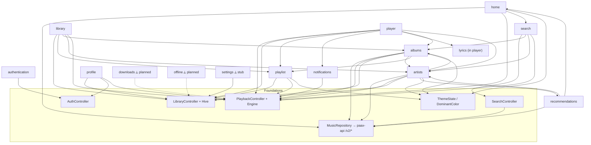

# Feature Dependency Map

> **Purpose**: Shows how Paax's features depend on each other and on the shared foundations (controllers, backend endpoints, Hive boxes). Use it to understand blast radius before changing a feature.
> **Update when**: A feature is added/removed or a cross-feature dependency changes.

Companion to [architecture.md](architecture.md) (system topology) and [frontend/navigation.md](frontend/navigation.md) (screen flow). Each feature has its own doc under [features/](README.md#features-docsfeatures).

---

## Foundations every feature builds on

| Foundation | What it provides | Doc |
|------------|------------------|-----|
| `PlaybackController` + `PlaybackEngine` | Play/queue/position for any track list | [features/player.md](features/player.md) |
| `LibraryController` + Hive | Liked / playlists / saved albums / followed / recent / pinned / hidden | [features/library.md](features/library.md), [database.md](database.md) |
| `SearchController` | Debounced search feeding many screens | [features/search.md](features/search.md) |
| `MusicRepositoryImpl` → paax-api `/v2/*` | All metadata (tracks/albums/artists/charts) | [api.md](api.md), [backend/services.md](backend/services.md) |
| `ThemeState` + `DominantColorService` | Ambient adaptive color/contrast | [frontend/theming.md](frontend/theming.md) |
| `AuthController` | Onboarding/login gate (demo stub) | [features/authentication.md](features/authentication.md) |

---

## Feature dependency graph

Dashed/⟂ nodes are **not implemented** (downloads, offline) or **stubs** (settings). See their feature docs.

---

## Feature → dependency table

| Feature | Controllers | Backend | Hive boxes | Notable cross-feature deps |
|---------|-------------|---------|------------|----------------------------|
| [home](features/home.md) | Search, Playback | `/v2/chart`, `/v2/search` | recent_searches | → search, albums, artists |
| [search](features/search.md) | Search, Playback | `/v2/search` | recent_searches | → albums, artists, genre browse |
| [library](features/library.md) | Library, Playback | — (reads Hive) | liked, playlists, saved_albums, followed_artists, settings | → playlist, albums, artists |
| [albums](features/albums.md) | Playback, Library | `/v2/album/{id}` | saved_albums | → artists, playlist |
| [artists](features/artists.md) | Playback, Library | `/v2/artist/{id}`, `/top`, `/albums` | followed_artists | → albums, discography, recommendations |
| [playlist](features/playlist.md) | Library, Playback | — | playlists, settings (pins) | ← library, player |
| [player](features/player.md) | Playback, Library | `/lyrics` | recently_played, liked | → notifications, playlist, albums, artists |
| [profile](features/profile.md) | Auth, Library, Playback | — | user_profile, recently_played | ← auth |
| [authentication](features/authentication.md) | Auth | — (demo) | user_profile, settings | gates whole app |
| [recommendations](features/recommendations.md) | Playback | `/v2/artist/{id}/top`, `/watch` | — | ← artists, home |
| [notifications](features/notifications.md) | Playback | — | — | ← player (media session only) |
| [downloads](features/downloads.md) *(planned)* | — | (would need a resolver) | stream_candidates *(unused)* | ← player |
| [offline](features/offline.md) *(planned)* | Library | — | all library boxes | ← downloads |
| [settings](features/settings.md) *(stub)* | Library | — | settings | — |

---

## Change blast-radius quick guide

- **Touching `PlaybackController`/`PlaybackEngine`** affects player, mini player, home, search, albums, artists, playlist, notifications — essentially everything that plays audio. Highest blast radius.
- **Touching Hive entities / `HiveStorage`** affects library, playlist, profile, search history, and requires migration care (`@HiveField` numbering — see [database.md](database.md)).
- **Touching paax-api `/v2/*` shapes** affects the repository mappers and every browse feature — update [api.md](api.md) and [backend/services.md](backend/services.md) together (Documentation Contract).
- **Touching `ThemeState`/`DominantColorService`** affects the adaptive color across all detail screens.

---

*Last updated: 2026-07-16*
