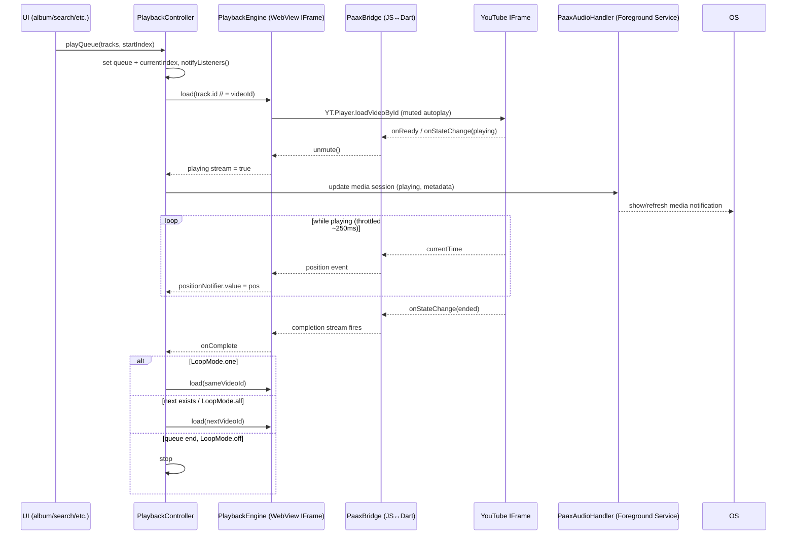

# Feature: Player

> **Purpose**: Documents the audio/media player — controls, states, queue management, and integration with the OS media session.
> **Update when**: Player controls, audio pipeline, or background playback behavior changes.

---

## Overview

The player is the center of Paax. Every screen is ultimately a path to it, and it is the one subsystem where the app's unusual architecture is most visible: **Paax does not decode audio itself**. It plays a YouTube `videoId` through a hidden YouTube IFrame player and treats that IFrame as its audio engine. There is no `just_audio`, no ExoPlayer, no `AVPlayer`, and — in the live path — no server-side stream proxy either. The `videoId` comes from the paax-api hybrid pipeline (Deezer metadata matched to a YouTube video; see [architecture](../architecture.md) and [api](../api.md)), and playback happens entirely in a WebView-hosted IFrame.

Two pieces cooperate:

- **`PlaybackController`** (`presentation/state/playback_controller.dart`) — a `ChangeNotifier` that owns the queue, the current index, shuffle/loop state, and the transport logic. It is the single source of truth the UI listens to. State management across the app is Provider + `ChangeNotifier` (not Riverpod/Bloc); see [state management](../frontend/state-management.md).
- **`PlaybackEngine`** (`core/playback/`) — an abstract interface with a **platform factory** that returns a WebView-backed IFrame implementation. The controller talks to the engine only through this interface, so the "how do we actually make sound" concern is fully isolated from the "what plays next" concern.

Because the audio element is a WebView, keeping it alive in the background is a first-class engineering problem — see [Background Playback](#background-playback).

---

## Player Modes / Views

The Full Player is an **overlay, not a route**. `MainWrapper` (the app shell, reachable app-wide via the static `MainWrapper.shellKey`) hosts a `SlideTransition` that slides the full-screen player up over the tab `IndexedStack`. This is why the bottom dock and tab navigation state survive while the player is open — nothing was pushed onto a `Navigator`. See [navigation](../frontend/navigation.md).

| Mode | Description | Trigger |
|------|-------------|---------|
| Mini Player | 67px bar docked above the bottom nav (`presentation/widgets/mini_player.dart`). Shows artwork, title/artist marquee, play/pause, and a thin progress line. | Always visible when a track is loaded (a non-null current track). |
| Full Player | Full-screen overlay (`presentation/screens/player_screen.dart`) with two modes — **Song** (large artwork, swipe left/right to skip) and **Lyrics** (synced view). Includes scrubber, shuffle/prev/play/next/loop, and overflow actions. | Tap the mini player, or `MainWrapper.shellKey.openPlayer()`. Drag down to dismiss (`closePlayer()`). |
| Lock Screen / Notification | Android OS media controls backed by the foreground service. | Automatic whenever a track is active (see [Background Playback](#background-playback)). |

The Full Player is the **only** place in the app with a live `BackdropFilter` — it blurs the artwork behind the controls (blur 55) with a ~55% scrim. Everywhere else, "glass" is faked with solid dark surfaces (blur is globally disabled; see [theming](../frontend/theming.md)).

---

## Playback Controls

| Control | Availability | Notes |
|---------|-------------|-------|
| Play / Pause | Mini + Full | Toggles `PlaybackController.togglePlayPause()`; drives `engine.play()/pause()` and updates the media session. |
| Skip Next | Mini (implicit via completion) + Full | `playNext()`. Honors shuffle order and `LoopMode.all` wrap-around. |
| Skip Previous | Full | `playPrevious()`. Restarts the current track if position > 3s, otherwise steps to the previous item. |
| Seek (scrub) | Full player | `SmoothAudioProgressBar` (60fps `Ticker` interpolation) → `engine.seek()`. |
| Volume | Hardware buttons only | No in-app volume slider; the IFrame plays at full volume and the OS controls system volume. |
| Shuffle | Full player | Toggles a shuffled index order over the queue. |
| Repeat / Loop | Full player | Cycles `LoopMode { off, all, one }`. `one` re-loads the same `videoId` on completion; `all` wraps the queue. |
| Like / Heart | Full player | Delegates to `LibraryController` (persists to the `liked_tracks` Hive box). See [library](library.md). |
| Add to Playlist | Full player + track tiles | Opens `add_to_playlist_sheet`. See [playlist](playlist.md). |
| Queue / Up Next | Full player | `queue_bottom_sheet` (`DraggableScrollableSheet`) — view and reorder the live queue. |
| Share | Full player overflow | Uses `share_plus` via `overflow_menu`. |

---

## Player States

The controller does not expose a single enum `state`; it exposes discrete observable fields (`isPlaying`, `positionNotifier`, `durationNotifier`, current track/index) plus engine streams. The logical states below are what those fields represent:

| State | Description |
|-------|-------------|
| `idle` | No current track. Mini player is hidden. |
| `loading` | `engine.load(videoId)` issued; IFrame is creating/cueing the `YT.Player`. UI shows the track but the scrubber sits at 0. |
| `playing` | IFrame reports playing; `isPlaying == true`; media session set to playing. |
| `paused` | Paused by user; IFrame paused, foreground service kept alive so the notification persists. |
| `buffering` | IFrame buffering mid-track; position stalls but playback resumes automatically. |
| `error` | IFrame reported an unplayable video / load failure (see [Error Handling](#error-handling)). |
| `completed` | IFrame fired the ended event → controller advances (next / loop-one). |

**Position/duration are deliberately not plain fields.** They update several times per second, and routing that through `notifyListeners()` would rebuild every `Consumer` in the tree. Instead they are exposed as `ValueNotifier`s — `positionNotifier` and `durationNotifier` — so only the scrubber and time labels rebuild. Engine position events are additionally throttled to ~250ms before being written to the notifier.

---

## Queue Management

- **Queue source**: Whatever context started playback — an album, a playlist, a chart row, "For You", search results, or a single track. `playQueue(tracks, startIndex)` seeds the queue; `playTrack(track)` plays a one-item queue.
- **Up Next**: The live queue is viewable and reorderable via `queue_bottom_sheet`. The controller supports `addToQueue`, `removeFromQueue`, and `reorderQueue`.
- **Shuffle**: Maintains a shuffled visiting order over the same underlying list; toggling off restores natural order relative to the current track.
- **Prefetch**: The controller prefetches **the next 1 track** (`engine.prefetchNext`) so the following IFrame load is warmer. It does not prefetch further ahead — WebView IFrames are expensive and YouTube throttles.
- **Autoplay after queue ends**: When the last track completes with `LoopMode.off`, playback simply stops. There is **no** automatic radio/recommendation continuation appended to the queue today. (Radio/"watch playlist" data exists on the API but is not auto-chained here — see [recommendations](recommendations.md).)

---

## Audio Pipeline

This is the part that most contradicts the boilerplate templates. Read it carefully.

- **Player Library**: A **YouTube IFrame** hosted in a WebView. Two platform implementations, chosen at compile time by `core/playback/playback_factory.dart` (conditional imports):
  - **Mobile (primary)**: `flutter_inappwebview`. An inline HTML page loads the YouTube `iframe_api`, constructs a `YT.Player`, does a **muted-autoplay-then-unmute** dance (browsers/WebViews block un-gestured audio), and bridges events to Dart over a JS↔Dart channel named **`PaaxBridge`**. `flutter_inappwebview` was chosen specifically over `webview_flutter` because it supports `allowBackgroundAudioPlaying: true`.
  - **Web/PWA**: `youtube_player_iframe` (the pub package).
  - **Stub**: throws — unsupported platforms fail loudly.
- **Stream Source**: **The `videoId` itself.** The IFrame streams from YouTube directly. Paax's own stream resolvers (`paax-stream`, the Cloudflare Worker, the legacy backend `/stream`) are **not on the live playback path**. `ApiConfig.streamBaseUrl` and `MusicRepository.getStreamUrl(videoId)` (`/stream/{videoId}`) are **defined but unused** — do not assume they participate. See [streaming/resolvers context in workers](../backend/workers.md) for the parallel, non-consumed resolver generations.
- **Format Support**: Whatever the YouTube IFrame negotiates internally — the app never sees a container/codec.
- **Buffering Strategy**: Delegated entirely to the YouTube player. Paax only observes position/buffering via bridge events.

### The hidden player host

A `HiddenVideoPlayer` (a 300×300 `InAppWebView`, `presentation/widgets/hidden_video_player.dart`) lives in the **root stack** of the app — not inside any tab — so it is never disposed by navigation. This offscreen WebView *is* the audio engine's DOM host. Keeping it mounted and alive is what makes continuous playback possible.

### Play flow

---

## Background Playback

- **Supported**: Yes, on Android.
- **Implementation**: `core/playback/paax_audio_handler.dart` — `PaaxAudioHandler extends BaseAudioHandler` (from `audio_service`). Crucially, **it does not play audio**. Its job is:
  1. Run an Android **foreground service** (`foregroundServiceType=mediaPlayback`) so the OS does not kill the process — and therefore does not kill the WebView that is actually producing sound.
  2. Publish the **OS media session**: metadata (title/artist/artwork), playback state, and position for the notification and lock screen.
  3. **Delegate transport controls back to `PlaybackController`** — a notification "next" tap calls into the controller, which drives the IFrame engine.

  On top of the service, the mobile engine runs WebView-level survival tricks so the IFrame keeps decoding when backgrounded: a **silent Web Audio oscillator**, a **~5s heartbeat**, and a **`visibilitychange` resume** handler.
- **OS Media Controls**: Yes on Android — play/pause/next/prev in the notification and on the lock screen, wired through `MediaButtonReceiver` and the declared `com.ryanheise.audioservice.AudioService`. Manifest permissions: `FOREGROUND_SERVICE`, `FOREGROUND_SERVICE_MEDIA_PLAYBACK`, `WAKE_LOCK`. See [Android config in architecture](../architecture.md). The web build's media session hooks (`media_session_web.dart`) are currently commented out.

See [notifications](notifications.md) for the media-notification detail (and why push notifications are a separate, unimplemented concern).

---

## Error Handling

| Error | Behavior |
|-------|---------|
| Video unplayable / removed / region-blocked | The IFrame reports an error state via the bridge; the controller surfaces an error for the track. Skipping to the next queue item is the practical recovery. |
| `videoId` never matched (`matchStatus: low_confidence` / absent) | Track has no usable playback id from the API, so load fails or plays a poor match; this is a metadata-pipeline quality issue, not a runtime bug (see [api](../api.md) matching). |
| Network loss during playback | The YouTube IFrame stalls/buffers; there is **no** in-app "no connection" banner and **no** offline fallback (nothing is downloaded). See [offline](offline.md). |
| Autoplay blocked (no user gesture) | Handled proactively by the muted-autoplay-then-unmute sequence in the engine HTML. |
| WebView killed in background | Mitigated (not eliminated) by the foreground service + Web Audio heartbeat + visibility resume. |

A dev-only `playback_debug_overlay` (reading `PlaybackDiagnosticsNotifier`) exists for inspecting engine state, though `playback_diagnostics.dart` reflects an older resolve-based architecture and is informational only.

---

## Related Files

- Controller: `frontend/lib/presentation/state/playback_controller.dart`
- Engine interface + factory: `frontend/lib/core/playback/playback_engine.dart`, `frontend/lib/core/playback/playback_factory.dart`
- Mobile engine: `frontend/lib/core/playback/playback_engine_mobile.dart`
- Foreground-service / media-session proxy: `frontend/lib/core/playback/paax_audio_handler.dart`
- Hidden WebView host: `frontend/lib/presentation/widgets/hidden_video_player.dart`
- Full player screen: `frontend/lib/presentation/screens/player_screen.dart`
- Mini player: `frontend/lib/presentation/widgets/mini_player.dart`
- Queue sheet: `frontend/lib/presentation/widgets/queue_bottom_sheet.dart`
- Scrubber: `frontend/lib/presentation/widgets/smooth_audio_progress_bar.dart`
- Synced lyrics: `frontend/lib/presentation/widgets/synced_lyrics_view.dart`
- App shell (overlay host): `frontend/lib/presentation/screens/main_wrapper.dart`

**See also:** [offline](offline.md) · [notifications](notifications.md) · [playlist](playlist.md) · [recommendations](recommendations.md) · [backend/workers (stream resolvers, not on live path)](../backend/workers.md) · [architecture](../architecture.md) · [api](../api.md)

---

*Last updated: 2026-07-16*
