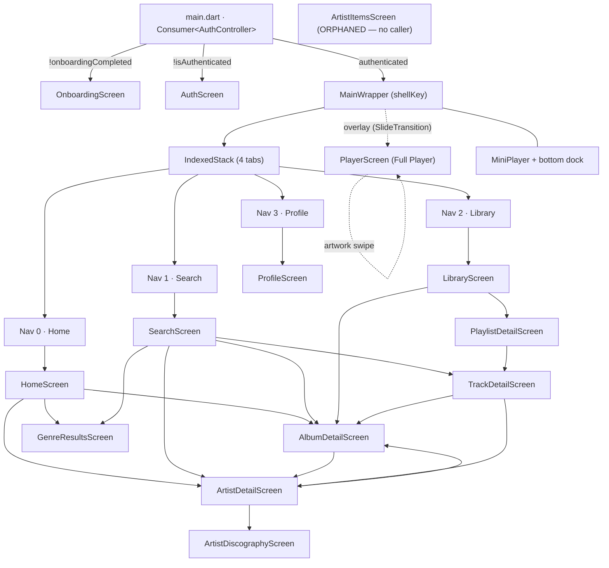
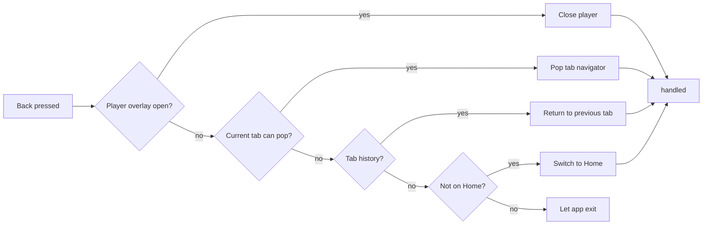

# Navigation

> **Purpose**: Documents the app's navigation structure — routes, navigation stack behavior, deep linking, and tab/drawer configuration.
> **Update when**: A new route is added, navigation behavior changes, or deep link patterns are updated.

---

## Navigation Library

> **Correction to the template**: there is **no `go_router` / `auto_route` / `Beamer`** and there are **no named routes**. Navigation is hand-rolled with the Flutter SDK `Navigator` plus a custom shell. See [routing](routing.md) for the technical mechanics (keys, `push`, observers).

- **Library**: Flutter SDK `Navigator` (imperative). No declarative router package.
- **Pattern**: **Imperative** — `Navigator.push(MaterialPageRoute(...))` into per-tab navigators, orchestrated by a static shell handle.
- **Deep Link Support**: **No in-app deep-link router.** PWA/TWA install works via `assetlinks.json`, but URLs do not resolve to specific screens (see [Deep Linking](#deep-linking)).
- **Shell file**: `lib/presentation/screens/main_wrapper.dart`

Related: [routing](routing.md) · [screens](screens.md) · [state-management](state-management.md) · [architecture](../architecture.md)

---

## Route Map

> There are no route *names* or *paths*. "Navigation" = pushing a `MaterialPageRoute` onto the active tab's `Navigator`. The table lists each destination, the widget, and how it is reached.

| Destination | Screen widget | Reached via | Auth gate |
|-------------|---------------|-------------|-----------|
| Onboarding | `OnboardingScreen` | root `Consumer<AuthController>` when `!onboardingCompleted` | pre-auth |
| Auth (login/signup) | `AuthScreen` | root `Consumer` when `!isAuthenticated` | pre-auth |
| Shell | `MainWrapper` | root `Consumer` when authenticated | — |
| Home (tab 0) | `HomeScreen` | shell `IndexedStack` index 0 | in-shell |
| Search (tab 1) | `SearchScreen` | shell `IndexedStack` index 1 | in-shell |
| Library (tab 2) | `LibraryScreen` | shell `IndexedStack` index 2 | in-shell |
| Profile (tab 3) | `ProfileScreen` | shell `IndexedStack` index 3 | in-shell |
| Album detail | `AlbumDetailScreen` | `push` from Home/Search/Library/Artist | in-shell |
| Artist detail | `ArtistDetailScreen` | `push` from track/album/search | in-shell |
| Artist discography | `ArtistDiscographyScreen` | `push` from Artist detail | in-shell |
| Artist items | `ArtistItemsScreen` | **orphaned** — no live caller | in-shell |
| Genre results | `GenreResultsScreen` | `push` from Search genre cards / Home rows | in-shell |
| Playlist detail | `PlaylistDetailScreen` | `push` from Library / add-to-playlist | in-shell |
| Track detail | `TrackDetailScreen` | `push` from Search only | in-shell |
| Full Player | `PlayerScreen` | **overlay**, not a route — `shellKey.openPlayer()` | in-shell |

See [screens](screens.md) for per-screen detail.

---

## Navigation Structure

The authenticated app is a **single `MainWrapper` shell** hosting an `IndexedStack` of 4 tabs. **Each tab owns its own nested `Navigator`** (its own `GlobalKey<NavigatorState>` and its own `RouteObserver`), so pushing a detail screen keeps the bottom dock and mini-player visible and preserves each tab's back-stack independently.



- **Bottom dock**: `MiniPlayer` (67px, shown only when a track exists) above 4 nav icons (Home/Search use SVG, Library/Profile use Material icons). A `HiddenVideoPlayer` (300×300 `InAppWebView`) also lives in the root stack — it is the actual audio host, kept off-screen.

> **Why per-tab `Navigator`s instead of one global stack?** So each tab remembers where you were (Search → Artist → Album stays intact when you visit Library and come back), and so the mini-player/dock never get covered by a pushed detail screen. A single global `Navigator` would either hide the dock or lose per-tab history. This mirrors the Spotify/Apple Music tab model.

---

## Authentication Guard

The gate is a plain `Consumer<AuthController>` at the app root in `main.dart` — **not** a router redirect:

```dart
home: Consumer<AuthController>(
  builder: (context, auth, _) {
    if (!auth.onboardingCompleted) return const OnboardingScreen();
    if (!auth.isAuthenticated)     return const AuthScreen();
    return MainWrapper(key: MainWrapper.shellKey);
  },
),
```

- Onboarding must be completed once (persisted to Hive `settings`), then the login gate applies.
- On successful (demo) login the controller flips `isAuthenticated`, `notifyListeners()` fires, and the `Consumer` rebuilds straight into the shell — there is no post-login redirect target to preserve because there is no URL routing.
- `logout()` clears Hive and flips the flags, rebuilding back to `AuthScreen`. See [state-management](state-management.md#authcontroller) and [auth feature](../features/authentication.md).

---

## Deep Linking

- **App scheme**: none registered for in-app routing.
- **Web/PWA**: served at `paaxmusic.app`; Android TWA is verified via Digital Asset Links (`assetlinks.json`). This makes the domain open the installed app, but **the app always boots at the shell root** — there is **no** router that parses `paaxmusic.app/albums/123` into `AlbumDetailScreen`.

| Deep Link | Resolves to | Status |
|-----------|-------------|--------|
| `paaxmusic.app` (TWA) | App launch → shell root (Home) | Works (launch only) |
| `paaxmusic.app/albums/:id` | — | **Not implemented** — no route parser |
| `paax://…` custom scheme | — | **Not registered** |

Adding real deep links would require introducing a router (or manual URL parsing) that maps a URL onto a `Navigator.push` into the correct tab. This is a known gap, not a bug.

---

## Back Navigation Rules

Android hardware/gesture back is handled by a custom `PopScope` calling `MainWrapper.onBackPressed()`, which runs the **same priority order in debug and release**:



- **Tab switching does not push a global route** — it flips `IndexedStack` index and records the previous index in a `_history` list so back can retrace tab visits.
- **Re-tapping the active tab** pops that tab's navigator to its root (`popUntil(isFirst)`).
- The **Full Player is dismissed, not popped** — it is an overlay toggled by `shellKey.closePlayer()` (also drag-to-dismiss), so it is intercepted first.
- **Android page transitions are instant** — a custom `_FastPageTransitionBuilder` returns the child unchanged (no slide/fade), for a snappier native feel.

See [routing](routing.md) for the shell handle (`MainWrapper.shellKey`), navigator keys, and `RouteObserver` wiring.

---

*Last updated: 2026-07-16*
