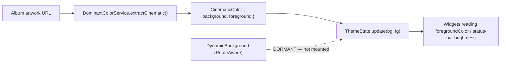

# Theming

> **Purpose**: Documents how the app's visual theme is implemented in code — ThemeData, color scheme, typography, and how to switch or extend the theme.
> **Update when**: Theme tokens change, a new theme mode is added, or the theme implementation approach changes.

---

## Theme Overview

> **Correction to the template**: Paax is **dark-only**. There is no light theme, no `ThemeMode.system` switch, no Riverpod `themeModeProvider`, and no `ThemeExtension`. Ignore the skeleton's light/dark `ColorScheme` pair and the theme-switching Riverpod snippet.

- **Framework**: Flutter `ThemeData` + **Material 3** (`useMaterial3: true`).
- **Supported Modes**: **Dark only.** (`ThemeState` is *not* a light/dark toggle — see below.)
- **Theme files**:
  - `lib/core/theme/app_colors.dart` — `AppColors` (the only real color-token source) + `primaryGradient`.
  - `lib/core/theme/app_theme.dart` — `AppTheme.darkTheme` (the single `ThemeData`).
  - `lib/presentation/state/theme_state.dart` — `ThemeState` (ambient runtime color, not a mode).
- **Design reference**: [`docs/design/design-system.md`](../design/design-system.md) · [`docs/design/colors.md`](../design/colors.md)

Related: [state-management](state-management.md#themestate) · [widgets](widgets.md#glassblur-system-blur-disabled).

---

## Theme Structure

> The skeleton's `colors.dart` / `typography.dart` / `spacing.dart` / `animations.dart` / `icons.dart` split does **not** exist. The real layout is minimal:

```
lib/core/theme/
  app_colors.dart   ← AppColors constants + primaryGradient
  app_theme.dart    ← AppTheme.darkTheme (Material 3, Roboto)
lib/presentation/state/
  theme_state.dart  ← ThemeState (ambient background/foreground color)
lib/core/utils/
  dominant_color_service.dart ← DominantColorService + CinematicColor
```

There is **no central spacing scale and no design-token file beyond `AppColors` + `BeatyGlassTokens`** (see [widgets](widgets.md)). Spacing is ad-hoc numeric literals; `Responsive` (`core/utils`) provides breakpoints (mobile 600, tablet 1200) and adaptive helpers. This is a known inconsistency versus the [ui rule](../../.claude/rules/ui.md)'s "spacing scale" ideal.

---

## Color Scheme

`AppColors` is the source of truth (all `static const`):

```dart
// lib/core/theme/app_colors.dart  (values)
background       = Color(0xFF080808); // near-black app background
surface          = Color(0xFF111111); // cards, glass, sheets
elevatedSurface  = Color(0xFF111111);
surfaceLight     = Color(0xFF111111);
primaryStart     = Color(0xFFFFFFFF); // white
primaryEnd       = Color(0xFFFF0055); // hot-pink accent
secondary        = Color(0xFF9D4EDD); // purple — mostly unused
textPrimary      = Colors.white;
textSecondary    = Colors.white70;
mutedText        = Color(0xFF8A8A8A);

// Signature gradient: white → hot pink
primaryGradient  = LinearGradient(colors: [primaryStart, primaryEnd]);
```

The `ColorScheme` is `ColorScheme.dark(...)` seeded from these — surfaces at `#111`, background `#080808`, the hot-pink `#FF0055` as the accent. The `primaryGradient` (white → `#FF0055`) is applied at call sites via `Ink`/`ShaderMask` (e.g. gradient elevated buttons), not through a single scheme role.

> **Why near-black + a single hot accent?** The whole aesthetic is "cinematic black" — solid dark chrome over album artwork (blur is disabled; see [widgets](widgets.md#glassblur-system-blur-disabled)). A single saturated accent (`#FF0055`) reads clearly against `#080808` without competing with cover art. Earlier orange accents were removed during the Phase 5 color work (see [release-notes](../release-notes.md)).

---

## Text Theme

Typography is deliberately simple — **one font, globally locked**:

- Font: **Roboto via `google_fonts`**, applied as the global `textTheme`/`fontFamily` in `AppTheme.darkTheme`.
- A source comment mentions *Manrope*, but the code uses **Roboto** — treat Roboto as authoritative.

```dart
// app_theme.dart (shape)
static ThemeData get darkTheme => ThemeData(
  useMaterial3: true,
  brightness: Brightness.dark,
  scaffoldBackgroundColor: AppColors.background,
  colorScheme: ColorScheme.dark(/* seeded from AppColors */),
  textTheme: GoogleFonts.robotoTextTheme(ThemeData.dark().textTheme),
  // ...
);
```

> **Why lock the font globally?** Some OEM Android skins override the default font and break layout metrics. Pinning `GoogleFonts.roboto*` at the theme root defeats OEM substitution and keeps text metrics identical across devices and on web. There is no separate `typography.dart` type scale — Material 3's default Roboto scale is used as-is.

---

## Component Theme Highlights (`AppTheme.darkTheme`)

| Component | Setting | Note |
|-----------|---------|------|
| `ElevatedButton` | radius 56, min-height 56 | gradient fill applied via `Ink` at call sites, not the theme |
| `Card` | radius 20, elevation 0 | flat, dark |
| `BottomSheet` | transparent background | so custom solid "glass" surfaces show through |
| Page transitions (Android) | **instant** | `_FastPageTransitionBuilder` returns child unchanged — snappier native feel |
| Scaffold | `AppColors.background` | `#080808` everywhere |

---

## `ThemeState` — ambient color, not a mode

`ThemeState` (a `ChangeNotifier`, see [state-management](state-management.md#themestate)) does **not** toggle light/dark. It carries an *ambient* color pair sampled from the current album art, used for contrast-aware chrome and status-bar icon brightness:

```dart
class ThemeState extends ChangeNotifier {
  Color _backgroundColor = AppColors.background;
  Color _foregroundColor = Colors.white;

  Color get backgroundColor => _backgroundColor;
  Color get foregroundColor => _foregroundColor;

  void update(Color bg, Color fg) {
    if (_backgroundColor == bg && _foregroundColor == fg) return;
    _backgroundColor = bg;
    _foregroundColor = fg;
    // also sets SystemUiOverlayStyle brightness for readable status-bar icons
    notifyListeners();
  }
}
```

---

## The color pipeline (DominantColorService → CinematicColor → ThemeState)



1. **`DominantColorService`** (`core/utils/dominant_color_service.dart`) samples an image and returns a `CinematicColor { Color background; Color foreground; }`. It has region-aware extraction (`extractCinematic`, `_extractBottomRegion`, `_extractGlobalAccent`) and a legacy path (`extractColor`, `_extractLegacy`), with a `foregroundOn(bg)` helper that picks a readable text color for a given background.
2. The result feeds **`ThemeState.update(bg, fg)`**.
3. Widgets that take a `foregroundColor` param adapt their contrast; the status-bar icon brightness is set to stay readable over the ambient color.

> **Dormant driver**: `DynamicBackground` is the widget meant to run this pipeline reactively (as a `RouteAware` that re-extracts on navigation) and push into `ThemeState` — but **no screen currently mounts it**. So today `ThemeState` only changes where a widget updates it directly, and the full "Apple Music-style color environment" is only partially live. This is stated honestly rather than implied as fully working. See [widgets](widgets.md) and [release-notes](../release-notes.md) (Phase 5 dynamic-color work).

---

## Accessing the Theme

```dart
// ✅ Theme via context
final scheme = Theme.of(context).colorScheme;
final text   = Theme.of(context).textTheme;

// ✅ Brand tokens directly (dark-only constants)
import 'package:beaty/core/theme/app_colors.dart';
Container(color: AppColors.surface);
DecoratedBox(decoration: BoxDecoration(gradient: AppColors.primaryGradient));

// ✅ Ambient color when contrast must follow artwork
final fg = context.watch<ThemeState>().foregroundColor;

// ❌ Never hardcode
const c = Color(0xFF6C63FF);
```

> Note the package import prefix is `beaty` — the Flutter package name is legacy (`beaty`); the product is Paax. See [architecture](../architecture.md).

---

## Theme Switching

**Not applicable — the app is dark-only by design.** There is no runtime light/dark switch. The only runtime "theme" change is the ambient `ThemeState` color derived from artwork (above), which adjusts contrast, not brightness mode.

---

## Extending the Theme

- **Add a color** → add a `static const` to `AppColors` (do not introduce a `ThemeExtension` — none is used).
- **Adjust component styling** → edit `AppTheme.darkTheme`.
- **Adjust glass/surface tokens** → `BeatyGlassTokens` in the glass system (see [widgets](widgets.md#glassblur-system-blur-disabled)).

A future light theme or a real spacing-token file would be net-new work; both are currently intentionally absent.

---

*Last updated: 2026-07-16*
