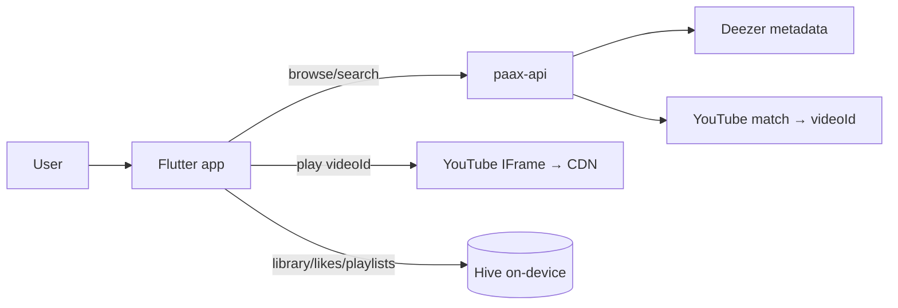

# Onboarding — Getting Started with Paax

> **Purpose**: The fastest path from "never seen this repo" to "productively making changes." Written for a senior engineer joining the project. Read this after [README.md](README.md) and before touching code.
> **Update when**: The setup steps, repo layout, or the core mental model change.

---

## 1. The 60-second mental model

Paax is a **music streaming app that owns no music**. It stitches two third-party services together:

- **Deezer** provides the *catalog metadata* (artists, albums, tracks, cover art) — clean and free, no API key.
- **YouTube** provides the *audio* — every Deezer track is matched to a YouTube `videoId`, which the app plays through an embedded YouTube **IFrame**.

The gluing happens in **paax-api**, whose "hybrid v2" pipeline returns Deezer metadata with a `playback.videoId` attached. The Flutter client stores **all user data on-device in Hive** — there is **no server database**. The backends are stateless proxies with caches.

If you internalize one sentence: **Deezer for what to show, YouTube for what to play, Hive for what the user keeps, and the servers just broker and cache.** Everything else is detail. Full depth: [architecture.md](architecture.md).



---

## 2. Repository map

A monorepo of four deployables + docs:

| Path | What it is | Language | Deep dive |
|------|-----------|----------|-----------|
| [`frontend/`](../frontend) | The Flutter app (package `beaty`, brand Paax) | Dart | [architecture.md](architecture.md), [frontend/](README.md#frontend-docsfrontend) |
| [`paax-api/`](../paax-api) | Metadata/discovery API (the one the app calls) | Python/FastAPI | [api.md](api.md), [backend/services.md](backend/services.md) |
| [`paax-stream/`](../paax-stream) | IPv6 audio byte proxy (deployed, **not used** by the live app) | Python/FastAPI | [backend/workers.md](backend/workers.md) |
| [`cloudflare-worker/`](../cloudflare-worker) | Edge stream-URL resolver (Innertube) | JS | [backend/workers.md](backend/workers.md) |
| [`backend/`](../backend) | Legacy monolith (ytmusicapi + yt-dlp), **superseded** | Python/FastAPI | [decisions.md](decisions.md) ADR-001 |
| [`docs/`](README.md) | This documentation set | Markdown | — |

Inside `frontend/lib/` the layout is **layer-first** (not feature-first): `core/` · `data/` · `domain/` · `presentation/`. See [coding-standards.md](coding-standards.md#file-organization).

---

## 3. Prerequisites

- **Flutter** SDK `>=3.3.0 <4.0.0` (Dart 3) — `flutter doctor` should be green for Android + Chrome.
- **Python 3.11** (for the backends you want to run locally).
- **Android Studio / SDK** for Android runs; **Chrome** for web runs.
- (Optional) **Redis** locally if you want to exercise server caching.
- A `git` client. Repo: `github.com/uzielcezate/Paax`.

You do **not** need Deezer or YouTube credentials — Deezer's API is keyless and playback uses the public IFrame. You only need `YTMUSIC_OAUTH_JSON` if you're touching the (rarely used) authenticated ytmusicapi library endpoints.

---

## 4. Run it locally (5 minutes)

The app can run against **production** backends with zero backend setup — the fastest way to see it working:

```bash
cd frontend
flutter pub get
flutter run -d chrome --dart-define=ENV=prod   # uses api.paaxmusic.app
```

To run the **metadata backend locally** too:

```bash
# Terminal 1 — paax-api
cd paax-api
python -m venv venv && source venv/bin/activate   # Windows: venv\Scripts\activate
pip install -r requirements.txt
uvicorn main:app --reload --host 0.0.0.0 --port 8000
# → http://127.0.0.1:8000/health  and  /v2/search?q=daft%20punk&type=tracks

# Terminal 2 — the app pointed at it
cd frontend
flutter run --dart-define=ENV=local            # 127.0.0.1:8000
```

Testing on a **physical device** over LAN:
```bash
flutter run --dart-define=ENV=lan --dart-define=LAN_IP=192.168.1.10
```

Full matrix (Android emulator via `10.0.2.2`, PWA build, etc.): [deployment.md](deployment.md). Env var reference: [environment.md](environment.md).

---

## 5. How a request actually flows (trace one to learn the codebase)

Follow "search for a song and play it" through the layers — it touches almost every important file:

1. **UI** — `search_screen.dart` calls `SearchController.onQueryChanged` (400 ms debounce).
2. **Controller** — `SearchController` (`presentation/state/`) calls `MusicRepositoryImpl.searchTracks`.
3. **Repository** — `MusicRepositoryImpl` (`data/repositories/`) calls `YouTubeMusicDataSource.searchV2` → `GET {ApiConfig.baseUrl}/v2/search`.
4. **Backend** — paax-api `/v2/search` → `services/hybrid/hybrid_search.py` → Deezer (`services/deezer/`) + YouTube match (`services/youtube/youtube_matcher.py`) → response with a `playback` block.
5. **Mapping** — `MusicRepositoryImpl._mapTrackV2` sets `Track.id = playback.videoId` (the critical line).
6. **Play** — tapping a result calls `PlaybackController.playQueue` → `PlaybackEngine.load(videoId)` → the YouTube IFrame in the hidden WebView plays. `PaaxAudioHandler` shows the media notification.

Read these six files in order and you'll understand 80% of the app. Details: [feature-map.md](feature-map.md), [features/player.md](features/player.md), [frontend/state-management.md](frontend/state-management.md).

---

## 6. Where things live (cheat sheet)

| I want to change… | Look in | Doc |
|-------------------|---------|-----|
| A screen's UI | `frontend/lib/presentation/screens/` | [frontend/screens.md](frontend/screens.md) |
| App-wide state/logic | `frontend/lib/presentation/state/*_controller.dart` | [frontend/state-management.md](frontend/state-management.md) |
| A reusable widget | `frontend/lib/presentation/widgets/` | [frontend/widgets.md](frontend/widgets.md) |
| Colors/theme | `frontend/lib/core/theme/` | [design/design-system.md](design/design-system.md) |
| Playback behavior | `frontend/lib/core/playback/` | [features/player.md](features/player.md) |
| Local persistence | `frontend/lib/data/local/hive_storage.dart` | [database.md](database.md) |
| An API endpoint | `paax-api/main.py` + `paax-api/services/` | [api.md](api.md), [backend/services.md](backend/services.md) |
| YouTube match quality | `paax-api/services/youtube/youtube_matcher.py` | [backend/services.md](backend/services.md) |
| Caching | `paax-api/cache.py` | [CACHE_STRATEGY.md](CACHE_STRATEGY.md) |

---

## 7. First-task playbooks

**Add a paax-api endpoint** → implement in `main.py` (+ a `services/` function if it has logic) → update [api.md](api.md) **and** [backend/controllers.md](backend/controllers.md) in the same change (Documentation Contract) → add a cache TTL if it's cacheable ([CACHE_STRATEGY.md](CACHE_STRATEGY.md)).

**Add a screen** → new file in `presentation/screens/`; navigate via `MainWrapper.shellKey.navigateTo(...)` (not a global router) → update [frontend/screens.md](frontend/screens.md) + [frontend/navigation.md](frontend/navigation.md) + the relevant [features/](README.md#features-docsfeatures) doc.

**Add a persisted field** → append a new `@HiveField(n)` (never renumber) → update [database.md](database.md); add a migration in `HiveStorage.init()` only if defaults don't suffice.

**Fix a bug** → check [KNOWN_ISSUES.md](KNOWN_ISSUES.md) first (it may be documented) → after fixing, move it to resolved and add a [CHANGELOG.md](CHANGELOG.md) entry.

Prompt templates for AI agents doing these tasks: [ai/prompts.md](ai/prompts.md).

---

## 8. Gotchas that will surprise you (read before debugging)

The single most important onboarding doc is [AI_NOTES.md](AI_NOTES.md). The highlights:

- **`just_audio` is not used** — a stale comment claims it is. Playback is a **YouTube IFrame**.
- **The stream resolvers (`paax-stream`, Cloudflare Worker) are not on the live path.** `getStreamUrl` / `ApiConfig.streamBaseUrl` are wired but **unused**. Don't assume they participate.
- **There is no server database.** Don't look for models/migrations/an ORM — user data is Hive on-device ([database.md](database.md)).
- **Auth is a demo stub** (`user@gmail.com` / `12345`). Not real ([features/authentication.md](features/authentication.md)).
- **"Glass" UI has blur disabled** except the full player — it's solid dark surfaces.
- **Dead code exists**: `deezer_api_client.dart`, `media_session_web.dart` (both commented out), the whole `paax-stream` resolver stack (orphaned), the legacy `backend`.
- **Branding drift**: package is `beaty`, Android `applicationId` is `com.beaty.music.beaty`, some READMEs still say "Beaty."
- **Release builds sign with debug keys** and the Deezer client uses `verify=False` — do not ship as-is ([security.md](security.md)).

---

## 9. Conventions & guardrails

- **Read before writing**, and **update docs in the same change** — the Documentation Contract in [PROJECT_RULES.md](../PROJECT_RULES.md) / [AGENTS.md](../AGENTS.md) maps each change type to the docs it must touch.
- Commits: [Conventional Commits](https://www.conventionalcommits.org/) (`feat:`, `fix:`, `style:`…), branch prefixes per [`.claude/rules/git.md`](../.claude/rules/git.md). No direct commits to `main`.
- Style: [coding-standards.md](coding-standards.md). Gate: `flutter analyze` + `dart format` (there are **no automated tests yet** — [testing.md](testing.md)).
- Decisions are settled in [decisions.md](decisions.md) — read it before re-litigating an architectural choice.

---

## 10. Where to go next

| You are a… | Start here |
|------------|-----------|
| Frontend engineer | [frontend/state-management.md](frontend/state-management.md) → [frontend/screens.md](frontend/screens.md) → [features/player.md](features/player.md) |
| Backend engineer | [api.md](api.md) → [backend/services.md](backend/services.md) → [CACHE_STRATEGY.md](CACHE_STRATEGY.md) |
| Designer / UI | [design/design-system.md](design/design-system.md) → [design/colors.md](design/colors.md) |
| Anyone | [architecture.md](architecture.md), [decisions.md](decisions.md), [glossary.md](glossary.md), [current-state.md](current-state.md) |

---

*Last updated: 2026-07-16*
